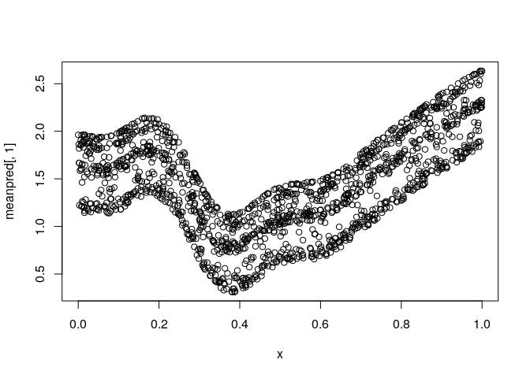
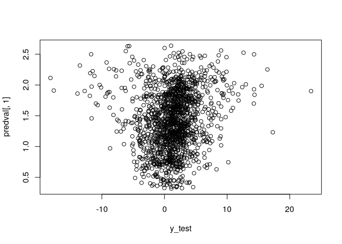

deepregression
==============

Fitting Deep Distributional Regression in R

Installation
============

Since the repository is still private, clone the repository to your local machine and run the following

``` r
library(devtools)
load_all("R")
```

    ## Loading deepregression

Also make sure you have installed all the dependencies:

-   Matrix
-   dplyr
-   keras
-   mgcv
-   reticulate
-   tensorflow
-   tfprobability

In the future, the package can be installed as follows:

To install the latest version of deepregression:

``` r
library(devtools)
install_github("davidruegamer/deepregression")
```

Examples
========

1.  [Deep Linear Regression](#deeplinearregression)
2.  [Deep Logistic Regression](#deeplogisticregression)
3.  [Deep GAM](#deepgam)
4.  [GAMLSS](#gamlss)
5.  [Deep GAMLSS](#deepgamlss)
6.  [Examples for each Distribution](#examplesforeachdistribution)

Deep Linear Regression
----------------------

We first create a very simple linear regression first where we try to model the non-linear part of the data generating process using a complex neural network and an intercept using a structured linear part.

``` r
set.seed(24)

# generate the data
n <- 1500
b0 <- 1

# training data; predictor 
x <- runif(n) %>% as.matrix()
true_mean_fun <- function(xx) sin(10*xx) + b0

# training data
y <- true_mean_fun(x) + rnorm(n = n, mean = 0, sd = 2)

data = data.frame(x = x)

# test data
x_test <- runif(n) %>% as.matrix()

validation_data = data.frame(x = x_test)

y_test <- true_mean_fun(x_test) + rnorm(n = n, sd = 2)
#####################################################################

#####################################################################
# Define a Deep Model
# We use three hidden layers for the location:
deep_model <- function(x) x %>% 
  layer_dense(units = 256, activation = "relu", use_bias = FALSE) %>%
  layer_dense(units = 128, activation = "relu") %>%
  layer_dropout(rate = 0.2) %>%
  layer_dense(units = 64, activation = "relu") %>% 
  layer_dropout(rate = 0.2) %>%
  layer_dense(units = 16, activation = "relu") %>% 
  layer_dense(units = 1, activation = "linear")
#####################################################################

#####################################################################
# Initialize the model using the function
# provided in deepregression
mod <- deepregression(
  # supply data (response and data.frame for covariates)
  y = y,
  data = data,
  # define how parameters should be modeled
  list_of_formulae = list(loc = ~ 1 + d(x), scale = ~1),
  list_of_deep_models = list(deep_model, NULL),
  # do not use early stopping (default)
  callbacks = list()
)
# fit model (may take a few minutes)
mod %>% fit(epochs=1000, verbose = FALSE, view_metrics = FALSE)
# predict
mean <- mod %>% fitted()
true_mean <- true_mean_fun(x)

# compare means
plot(true_mean ~ x, ylab="partial effect")
points(c(as.matrix(mean)) ~ x, col = "red")
legend("bottomright", col=1:2, pch = 1, legend=c("true mean", "deep prediction"))
```


Deep Logistic Regression
------------------------

We create a very simple logistic regression first where we try to model the non-linear part of the data generating process using a complex neural network and an intercept using a structured linear part.

``` r
set.seed(24)

# generate the data
n <- 1500
b0 <- 1

# training data; predictor 
x <- runif(n) %>% as.matrix()
true_mean_fun <- function(xx) plogis(sin(10*xx) + b0)

# training data
y <- rbinom(n = n, size = 1, prob = true_mean_fun(x))

data = data.frame(x = x)

# test data
x_test <- runif(n) %>% as.matrix()

validation_data = data.frame(x = x_test)

y_test <- rbinom(n = n, size = 1, prob = true_mean_fun(x_test))
#####################################################################

#####################################################################
# Define a Deep Model
# We use three hidden layers for the location:
deep_model <- function(x) x %>% 
  layer_dense(units = 128, activation = "relu", use_bias = FALSE) %>%
  layer_dense(units = 64, activation = "relu") %>%
  layer_dropout(rate = 0.2) %>%
  layer_dense(units = 32, activation = "relu") %>% 
  layer_dropout(rate = 0.2) %>%
  layer_dense(units = 8, activation = "relu") %>% 
  layer_dense(units = 1, activation = "linear")
#####################################################################

#####################################################################
# Initialize the model using the function
# provided in deepregression
mod <- deepregression(
  # supply data (response and data.frame for covariates)
  y = y,
  data = data,
  # define how parameters should be modeled
  list_of_formulae = list(logits = ~ 1 + d(x)),
  list_of_deep_models = list(deep_model),
  # family binomial
  family = "bernoulli"
)
# fit model
mod %>% fit(epochs=100, verbose = FALSE, view_metrics = FALSE)
# predict
mean <- mod %>% predict(newdata = validation_data)
true_mean <- true_mean_fun(x_test)

# compare means
plot(true_mean ~ x_test, ylab="partial effect")
points(c(as.matrix(mean)) ~ x_test, col = "red")
legend("bottomright", col=1:2, pch = 1, legend=c("true mean", "deep prediction"))
```


Deep GAM
--------

We now create a very simple logistic additive regression first where we try to model the non-linear part of the data generating process using both a complex neural network and a spline.

``` r
set.seed(24)

# generate the data
n <- 1500
b0 <- 1

# training data; predictor 
x <- runif(n) %>% as.matrix()
true_mean_fun <- function(xx) plogis(sin(10*xx) + b0)

# training data
y <- rbinom(n = n, size = 1, prob = true_mean_fun(x))

data = data.frame(x = x)

# test data
x_test <- runif(n) %>% as.matrix()

validation_data = data.frame(x = x_test)

y_test <- rbinom(n = n, size = 1, prob = true_mean_fun(x_test))
#####################################################################

#####################################################################
# Define a Deep Model
# We use three hidden layers for the location:
deep_model <- function(x) x %>% 
  layer_dense(units = 128, activation = "relu", use_bias = FALSE) %>%
  layer_dense(units = 64, activation = "relu") %>%
  layer_dropout(rate = 0.2) %>%
  layer_dense(units = 32, activation = "relu") %>% 
  layer_dropout(rate = 0.2) %>%
  layer_dense(units = 8, activation = "relu") %>% 
  layer_dense(units = 1, activation = "linear")
#####################################################################

#####################################################################
# Initialize the model using the function
# provided in deepregression
mod <- deepregression(
  # supply data (response and data.frame for covariates)
  y = y,
  data = data,
  # define how parameters should be modeled
  list_of_formulae = list(logits = ~ 1 + s(x, bs = "tp") + d(x)),
  list_of_deep_models = list(deep_model),
  # family binomial n=1
  family = "bernoulli",
  df = 10 # use no penalization for spline
)
# fit model
mod %>% fit(epochs=100, verbose = FALSE, view_metrics = FALSE)
# plot model
par(mfrow=c(1,2))
plot(true_mean_fun(x) ~ x)
mod %>% plot()
```


GAMLSS
------

We not create a standard GAMLSS model with Gaussian distribution by modeling the expectation using additive terms and the standard deviation by a linear term.

``` r
set.seed(24)

# generate the data
n <- 1500
b0 <- 1

# training data; predictor 
x <- runif(n) %>% as.matrix()
z <- runif(n) %>% as.matrix()
true_mean_fun <- function(xx,zz) sin(10*xx) + zz^2 + b0
true_sd_fun <- function(xl) exp(2 * xl)
true_dgp_fun <- function(xx,zz)
{
  
  eps <- rnorm(n) * true_sd_fun(xx)
  y <- true_mean_fun(xx, zz) + eps
  return(y)
  
}

# compose training data with heteroscedastic errors
y <- true_dgp_fun(x,z)
data = data.frame(x = x, z = z)

# test data
x_test <- runif(n) %>% as.matrix()
z_test <- runif(n) %>% as.matrix()

validation_data = data.frame(x = x_test, z = z_test)

y_test <- true_dgp_fun(x_test, z_test)
#####################################################################

#####################################################################
# Define a Deep Model
# We use three hidden layers for the location:
deep_model <- function(x) x %>% 
  layer_dense(units = 128, activation = "relu", use_bias = FALSE) %>%
  layer_dense(units = 64, activation = "relu") %>%
  layer_dropout(rate = 0.2) %>%
  layer_dense(units = 32, activation = "relu") %>% 
  layer_dropout(rate = 0.2) %>%
  layer_dense(units = 8, activation = "relu") %>% 
  layer_dense(units = 1, activation = "linear")
#####################################################################

#####################################################################
# Initialize the model using the function
# provided in deepregression
mod <- deepregression(
  # supply data (response and data.frame for covariates)
  y = y,
  data = data,
  # define how parameters should be modeled
  list_of_formulae = list(loc = ~ 1 + s(x, bs="tp") + s(z, bs="tp"),
                          scale = ~ 0 + x),
  list_of_deep_models = list(NULL, deep_model),
  # family binomial n=1
  family = "normal"
)
# fit model
mod %>% fit(epochs=1000, verbose = FALSE, view_metrics = FALSE)
# summary(mod)
# coefficients
mod %>% coef()
```

    ## $loc
    ## $loc$structured_nonlinear
    ##               [,1]
    ##  [1,]  0.033197686
    ##  [2,]  0.049622998
    ##  [3,] -0.052985322
    ##  [4,] -0.783396900
    ##  [5,] -0.469053209
    ##  [6,]  0.329968631
    ##  [7,] -0.169152096
    ##  [8,]  0.558192432
    ##  [9,]  0.285193682
    ## [10,]  0.719064355
    ## [11,]  0.204464868
    ## [12,] -0.329066783
    ## [13,]  0.116332658
    ## [14,]  0.012124837
    ## [15,]  0.215815097
    ## [16,] -0.047077250
    ## [17,]  0.214377537
    ## [18,]  0.069556557
    ## [19,]  0.169384703
    ## [20,]  0.493280739
    ## [21,] -0.008492824
    ## 
    ## 
    ## $scale
    ## $scale$structured_linear
    ##          [,1]
    ## [1,] 1.943266

``` r
# plot model
par(mfrow=c(2,2))
plot(sin(10*x) ~ x)
plot(z^2 ~ z)
mod %>% plot()
```


``` r
# get fitted values
meanpred <- mod %>% fitted()
par(mfrow=c(1,1))
plot(meanpred[,1] ~ x)
```



``` r
# predict
predval <- mod %>% predict(newdata = validation_data)
plot(predval[,1] ~ y_test)
```



Deep GAMLSS
-----------

We now extend the example 4 by a Deep model part.

``` r
set.seed(24)

# generate the data
n <- 1500
b0 <- 1

# training data; predictor 
x <- runif(n) %>% as.matrix()
z <- runif(n) %>% as.matrix()
true_mean_fun <- function(xx,zz) sin(10*xx) + zz^2 + b0
true_sd_fun <- function(xl) exp(2 * xl)
true_dgp_fun <- function(xx,zz)
{
  
  eps <- rnorm(n) * true_sd_fun(xx)
  y <- true_mean_fun(xx, zz) + eps
  return(y)
  
}

# compose training data with heteroscedastic errors
y <- true_dgp_fun(x,z)
data = data.frame(x = x, z = z)

# test data
x_test <- runif(n) %>% as.matrix()
z_test <- runif(n) %>% as.matrix()

validation_data = data.frame(x = x_test, z = z_test)

y_test <- true_dgp_fun(x_test, z_test)
#####################################################################

#####################################################################
# Define a Deep Model
# We use three hidden layers for the location:
deep_model <- function(x) x %>% 
  layer_dense(units = 128, activation = "relu", use_bias = FALSE) %>%
  layer_dense(units = 64, activation = "relu") %>%
  layer_dropout(rate = 0.2) %>%
  layer_dense(units = 32, activation = "relu") %>% 
  layer_dropout(rate = 0.2) %>%
  layer_dense(units = 8, activation = "relu") %>% 
  layer_dense(units = 1, activation = "linear")
#####################################################################

#####################################################################
# Initialize the model using the function
# provided in deepregression
mod <- deepregression(
  # supply data (response and data.frame for covariates)
  y = y,
  data = data,
  # define how parameters should be modeled
  list_of_formulae = list(loc = ~ 1 + s(x, bs="tp") + d(z),
                          scale = ~ 1 + x),
  list_of_deep_models = list(deep_model, NULL),
  # family normal
  family = "normal"
)
# fit model
mod %>% fit(epochs=500, verbose = FALSE, view_metrics = FALSE)
# plot model
mod %>% plot()
```


``` r
# get coefficients
mod %>% coef()
```

    ## $loc
    ## $loc$structured_nonlinear
    ##               [,1]
    ##  [1,] -0.004862042
    ##  [2,]  0.085962355
    ##  [3,] -0.063140228
    ##  [4,] -1.314705849
    ##  [5,] -0.687673390
    ##  [6,] -0.158444047
    ##  [7,] -0.077457078
    ##  [8,]  0.457390159
    ##  [9,]  0.192678884
    ## [10,]  0.788696706
    ## [11,]  0.576545537
    ## 
    ## 
    ## $scale
    ## $scale$structured_linear
    ##            [,1]
    ## [1,] -0.1856159
    ## [2,]  1.8967324

Examples for each Distribution
------------------------------

In this example we just demonstrate all the distributions that can currently be fitted using the deepregression framework. Updates will happen quite frequently.

``` r
set.seed(24)

# generate the data
n <- 1500
b0 <- 1

# training data; predictor 
x <- runif(n) %>% as.matrix()
z <- runif(n) %>% as.matrix()
y <- runif(n) %>% as.matrix()
data = data.frame(x = x, z = z)

dists = 
c(
"normal", "bernoulli", "bernoulli_prob", 
"beta", "betar", "cauchy", "chi2", "chi","exponential",
"gamma", "gammar", "gumbel", "half_cauchy", "half_normal", "horseshoe",
"inverse_gamma", "inverse_gaussian", "laplace", "log_normal",
"logistic", "negbinom", "negbinom", "pareto", 
"poisson", "poisson_lograte", "student_t",
"student_t_ls", "uniform"
)
#####################################################################

#####################################################################
# check out if distributions work
#####################################################################
silent = TRUE
for(dist in dists)
{
  cat("Fitting", dist, "model... ")
  suppressWarnings(
    mod <- try(deepregression(
      y = y,
      data = data,
      # define how parameters should be modeled
      list_of_formulae = list(~ 1 + x, ~ 1 + z, ~ 1),
      list_of_deep_models = NULL,
      family = dist
    ), silent=silent)
  )
  # test if model can be fitted
  if(class(mod)=="try-error")
  {
    cat("Failed to initialize the model.\n")
    next
  }
  fitting <- try(
    mod %>% fit(epochs=2, verbose = FALSE, view_metrics = FALSE),
    silent=silent
  )
  if(class(fitting)=="try-error") 
    cat("Failed to fit the model.\n") else
      cat("Success.\n")
}
```

    ## Fitting normal model... Success.
    ## Fitting bernoulli model... Success.
    ## Fitting bernoulli_prob model... Success.
    ## Fitting beta model... Success.
    ## Fitting betar model... Success.
    ## Fitting cauchy model... Success.
    ## Fitting chi2 model... Success.
    ## Fitting chi model... Success.
    ## Fitting exponential model... Success.
    ## Fitting gamma model... Success.
    ## Fitting gammar model... Success.
    ## Fitting gumbel model... Success.
    ## Fitting half_cauchy model... Success.
    ## Fitting half_normal model... Success.
    ## Fitting horseshoe model... Success.
    ## Fitting inverse_gamma model... Success.
    ## Fitting inverse_gaussian model... Success.
    ## Fitting laplace model... Success.
    ## Fitting log_normal model... Success.
    ## Fitting logistic model... Success.
    ## Fitting negbinom model... Success.
    ## Fitting negbinom model... Success.
    ## Fitting pareto model... Success.
    ## Fitting poisson model... Success.
    ## Fitting poisson_lograte model... Success.
    ## Fitting student_t model... Success.
    ## Fitting student_t_ls model... Success.
    ## Fitting uniform model... Success.
