# deepregression

Fitting Semistructured Deep Distributional Models in R

# Installation

Since the repository is still private, clone the repository to your
local machine and run the following

    ## Loading required package: usethis

    ## Loading deepregression

    ## 

    ## Done!

    ## 
    ## Attaching package: 'testthat'

    ## The following object is masked from 'package:devtools':
    ## 
    ##     test_file

    ## Configuring package 'deepregression': please wait ...

    ## Done!

Also make sure you have installed all the dependencies:

  - Matrix
  - dplyr
  - keras
  - mgcv
  - reticulate
  - tensorflow
  - tfprobability

In the future, the package can be installed as follows:

To install the latest version of deepregression:

``` r
library(devtools)
install_github("davidruegamer/deepregression")
```

# Examples

1.  [Deep Additive Regression](#deep-linear-regression)
2.  [Deep Logistic Regression](#deep-logistic-regression)
3.  [Deep GAM](#deep-gam)
4.  [GAMLSS](#gamlss)
5.  [Deep GAMLSS](#deep-gamlss)
6.  [Examples for each Distribution](#examples-for-each-distribution)
7.  [Real World Applications](#real-world-applications)
    1.  [Deep Mixed Model for Wage Panel
        Data](#deep-mixed-model-for-wage-panel-data)
    2.  [Deep Quantile Regression on Motorcycle
        Data](#deep-quantile-regression-on-motorcycle-data)
    3.  [High-Dimensional Ridge and Lasso Regression on Colon Cancer
        Data](#high-dimensional-ridge-and-lasso-regression)
    4.  [Mixture distribution for Acidity Modeling](#mixture-of-normals)
8.  [Unstructured Data Examples](#unstructured-data-examples)
    1.  [MNIST Pictures with Binarized Response](#mnist-zeros)
    2.  [MNIST Pictures with Multinomial Response](#mnist-multinomial)
    3.  [Sentiment Analysis using IMDB Reviews](#text-as-input)
9.  [Zero-inflated Poisson
    Distribution](#zero-inflated-poisson-distribution)

## Deep Additive Regression

We first create a very simple regression where we try to model the
non-linear part of the data generating process using a complex neural
network and an intercept using a structured linear part.

``` r
set.seed(24)

# generate the data
n <- 1500
b0 <- 1

# training data; predictor 
x <- runif(n) %>% as.matrix()
true_mean_fun <- function(xx) sin(10*xx) + b0

# training data
y <- true_mean_fun(x) + rnorm(n = n, mean = 0, sd = 2)

data = data.frame(x = x)

# test data
x_test <- runif(n) %>% as.matrix()

validation_data = data.frame(x = x_test)

y_test <- true_mean_fun(x_test) + rnorm(n = n, sd = 2)
#####################################################################

#####################################################################
# Define a Deep Model
# We use three hidden layers for the location:
deep_model <- function(x) x %>% 
  layer_dense(units = 256, activation = "relu", use_bias = FALSE) %>%
  layer_dense(units = 128, activation = "relu") %>%
  layer_dropout(rate = 0.2) %>%
  layer_dense(units = 64, activation = "relu") %>% 
  layer_dropout(rate = 0.2) %>%
  layer_dense(units = 16, activation = "relu") %>% 
  layer_dense(units = 1, activation = "linear")
#####################################################################

#####################################################################
# Initialize the model using the function
# provided in deepregression
mod <- deepregression(
  # supply data (response and data.frame for covariates)
  y = y,
  data = data,
  # define how parameters should be modeled
  list_of_formulae = list(loc = ~ 1 + d(x), scale = ~1),
  list_of_deep_models = list(deep_model)
)
# fit model (may take a few minutes)
mod %>% fit(epochs=1000, verbose = FALSE, view_metrics = FALSE)
# predict
mean <- mod %>% fitted()
true_mean <- true_mean_fun(x) - b0

# compare means
plot(true_mean + b0 ~ x, ylab="partial effect")
points(c(as.matrix(mean)) ~ x, col = "red")
legend("bottomright", col=1:2, pch = 1, legend=c("true mean", "deep prediction"))
```

<!-- -->

This is just for demonstration that a neural network can also capture
non-linearities, but often requires a lot of effort to get proper smooth
estimates.

## Deep GAM

We now create a very simple logistic additive regression first where we
try to model the non-linear part of the data generating process using
both a complex neural network and a spline.

``` r
set.seed(24)

# generate the data
n <- 1500
b0 <- 1

# training data; predictor 
x <- runif(n) %>% as.matrix()
true_mean_fun <- function(xx) plogis(sin(10*xx) + b0)

# training data
y <- rbinom(n = n, size = 1, prob = true_mean_fun(x))

data = data.frame(x = x)

# test data
x_test <- runif(n) %>% as.matrix()

validation_data = data.frame(x = x_test)

y_test <- rbinom(n = n, size = 1, prob = true_mean_fun(x_test))
#####################################################################

#####################################################################
# Define a Deep Model
# We use three hidden layers for the location:
deep_model <- function(x) x %>% 
  layer_dense(units = 128, activation = "relu", use_bias = FALSE) %>%
  layer_dense(units = 64, activation = "relu") %>%
  layer_dropout(rate = 0.2) %>%
  layer_dense(units = 32, activation = "relu") %>% 
  layer_dropout(rate = 0.2) %>%
  layer_dense(units = 8, activation = "relu") %>% 
  layer_dense(units = 1, activation = "linear")
#####################################################################

#####################################################################
# Initialize the model using the function
# provided in deepregression
mod <- deepregression(
  # supply data (response and data.frame for covariates)
  y = y,
  data = data,
  # define how parameters should be modeled
  list_of_formulae = list(logits = ~ 1 + s(x, bs = "tp") + d(x)),
  list_of_deep_models = list(deep_model),
  # family binomial n=1
  family = "bernoulli",
  df = 10 # use no penalization for spline
)
# fit model, save weights
history <- mod %>% fit(epochs=100, verbose = FALSE, view_metrics = FALSE,
                       save_weights = TRUE)

# plot history of spline
BX <- mod$init_params$parsed_formulae_contents[[1]][[2]]$x$X
coef_history <- history$weighthistory[-1,]
f_history <- sapply(1:ncol(coef_history), function(j) BX%*%coef_history[,j])
library(ggplot2)
library(reshape2)
df <- melt(cbind(x=x, as.data.frame(f_history)), id.vars="x")
df$variable = as.numeric(df$variable)
ggplot(df, aes(x=x,y=value, colour=as.integer(variable), group=factor(variable))) + 
  geom_line() + 
  scale_colour_gradient(name = "epoch", 
                        low = "blue", high = "red") + 
  ylab("partial effect s(x)") + theme_bw()
```

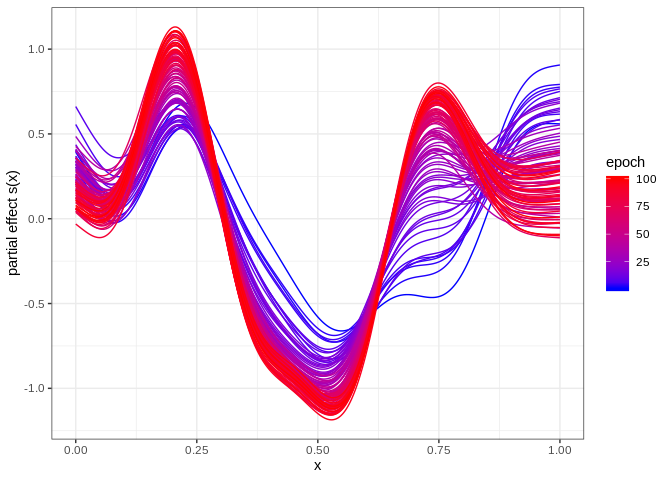<!-- -->

We can check which of the function the cross-validation would have
chosen by doing the following:

``` r
mod <- deepregression(
  # supply data (response and data.frame for covariates)
  y = y,
  data = data,
  # define how parameters should be modeled
  list_of_formulae = list(logits = ~ 1 + s(x, bs = "tp") + d(x)),
  list_of_deep_models = list(deep_model),
  # family binomial n=1
  family = "bernoulli",
  df = 10 # use no penalization for spline
)
cvres <- mod %>% cv(epochs=100)
```

    ## Warning in cv(., epochs = 100): No folds for CV given, using k = 10.

    ## Fitting Fold  1  ... 
    ## Done in 9.354302  secs 
    ## Fitting Fold  2  ... 
    ## Done in 8.475876  secs 
    ## Fitting Fold  3  ... 
    ## Done in 8.37732  secs 
    ## Fitting Fold  4  ... 
    ## Done in 8.433299  secs 
    ## Fitting Fold  5  ... 
    ## Done in 8.50964  secs 
    ## Fitting Fold  6  ... 
    ## Done in 8.548075  secs 
    ## Fitting Fold  7  ... 
    ## Done in 8.562343  secs 
    ## Fitting Fold  8  ... 
    ## Done in 8.641298  secs 
    ## Fitting Fold  9  ... 
    ## Done in 8.57056  secs 
    ## Fitting Fold  10  ... 
    ## Done in 8.363687  secs

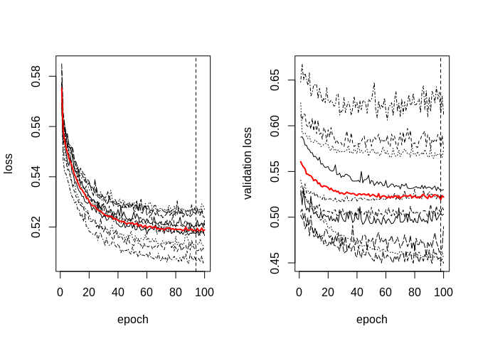<!-- -->

Get the optimal stopping iteration and train the whole model again:

``` r
bestiter <- stop_iter_cv_result(cvres)
# fit model
mod %>% fit(epochs=bestiter, verbose = FALSE, view_metrics = FALSE)
# plot model
mod %>% plot()
points(sin(10*(sort(x))) ~ sort(x), col = "red", type="l", ylim=c(0,1))
```

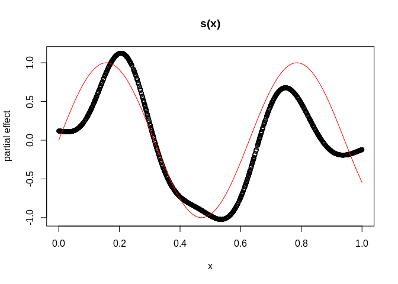<!-- -->

Now we fit it using variational mean field inference:

``` r
mod <- deepregression(
  # supply data (response and data.frame for covariates)
  y = y,
  data = data,
  # define how parameters should be modeled
  list_of_formulae = list(logits = ~ 1 + s(x, bs = "tp") + d(x)),
  list_of_deep_models = list(deep_model),
  # family binomial n=1
  family = "bernoulli",
  validation_split = NULL,
  variational = TRUE,
  df = 10
)
cvres <- mod %>% cv(cv_folds = 5, epochs=500)
```

    ## Fitting Fold  1  ... 
    ## Done in 45.24328  secs 
    ## Fitting Fold  2  ... 
    ## Done in 43.29304  secs 
    ## Fitting Fold  3  ... 
    ## Done in 43.59649  secs 
    ## Fitting Fold  4  ... 
    ## Done in 44.08932  secs 
    ## Fitting Fold  5  ... 
    ## Done in 51.90815  secs

<!-- -->

``` r
bestiter <- stop_iter_cv_result(cvres)
# fit model
mod %>% fit(epochs=10000, verbose = FALSE, view_metrics = FALSE)
# plot model
mod %>% plot(use_posterior=TRUE)
points(sin(10*(sort(x))) ~ sort(x), col = "red", type="l", ylim=c(0,1))
```

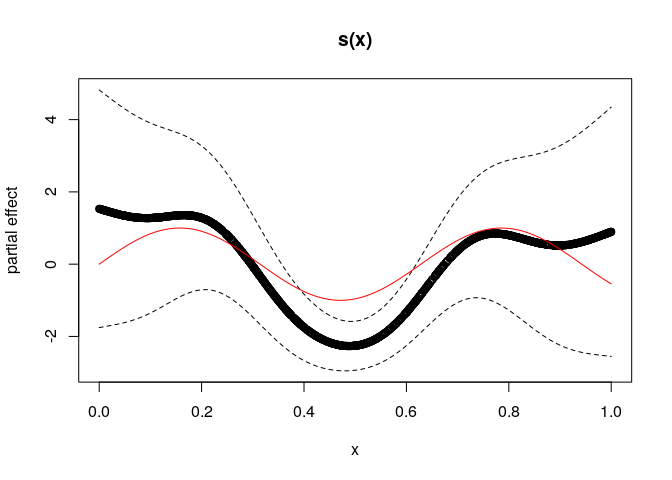<!-- -->

## GAMLSS

We not create a standard GAMLSS model with Gaussian distribution by
modeling the expectation using additive terms and the standard deviation
by a linear term.

``` r
set.seed(24)

# generate the data
n <- 1500
b0 <- 1

# training data; predictor 
x <- runif(n) %>% as.matrix()
z <- runif(n) %>% as.matrix()
true_mean_fun <- function(xx,zz) sin(10*xx) + zz^2 + b0
true_sd_fun <- function(xl) exp(2 * xl)
true_dgp_fun <- function(xx,zz)
{
  
  eps <- rnorm(n) * true_sd_fun(xx)
  y <- true_mean_fun(xx, zz) + eps
  return(y)
  
}

# compose training data with heteroscedastic errors
y <- true_dgp_fun(x,z)
data = data.frame(x = x, z = z)

# test data
x_test <- runif(n) %>% as.matrix()
z_test <- runif(n) %>% as.matrix()

validation_data = data.frame(x = x_test, z = z_test)

y_test <- true_dgp_fun(x_test, z_test)
#####################################################################

#####################################################################
# Define a Deep Model
# We use three hidden layers for the location:
deep_model <- function(x) x %>% 
  layer_dense(units = 128, activation = "relu", use_bias = FALSE) %>%
  layer_dense(units = 64, activation = "relu") %>%
  layer_dropout(rate = 0.2) %>%
  layer_dense(units = 32, activation = "relu") %>% 
  layer_dropout(rate = 0.2) %>%
  layer_dense(units = 8, activation = "relu") %>% 
  layer_dense(units = 1, activation = "linear")
#####################################################################

#####################################################################
# Initialize the model using the function
# provided in deepregression
mod <- deepregression(
  # supply data (response and data.frame for covariates)
  y = y,
  data = data,
  # define how parameters should be modeled
  list_of_formulae = list(loc = ~ 1 + s(x, bs="tp") + s(z, bs="tp"),
                          scale = ~ 0 + x),
  list_of_deep_models = list(NULL, deep_model),
  # family binomial n=1
  family = "normal",
  df = 10
)
# fit model
mod %>% fit(epochs=2000, verbose = FALSE, view_metrics = FALSE)
# summary(mod)
# coefficients
mod %>% coef()
```

    ## $loc
    ## $loc$structured_nonlinear
    ##              [,1]
    ##  [1,]  0.84839368
    ##  [2,]  0.86893094
    ##  [3,] -0.35677627
    ##  [4,] -2.65775204
    ##  [5,] -0.83369523
    ##  [6,] -0.03912989
    ##  [7,]  0.45583653
    ##  [8,]  1.23418522
    ##  [9,] -0.81973726
    ## [10,]  0.38997889
    ## [11,]  2.44427371
    ## [12,]  0.67017853
    ## [13,] -0.58960259
    ## [14,]  0.05656475
    ## [15,] -0.19247641
    ## [16,] -0.34294558
    ## [17,]  0.17487967
    ## [18,] -0.30058622
    ## [19,] -0.62072754
    ## [20,]  0.73902410
    ## [21,]  1.92936766
    ## 
    ## 
    ## $scale
    ## $scale$structured_linear
    ##          [,1]
    ## [1,] 2.046165

``` r
# plot model
par(mfrow=c(2,2))
plot(sin(10*x) ~ x)
plot(z^2 ~ z)
mod %>% plot()
```

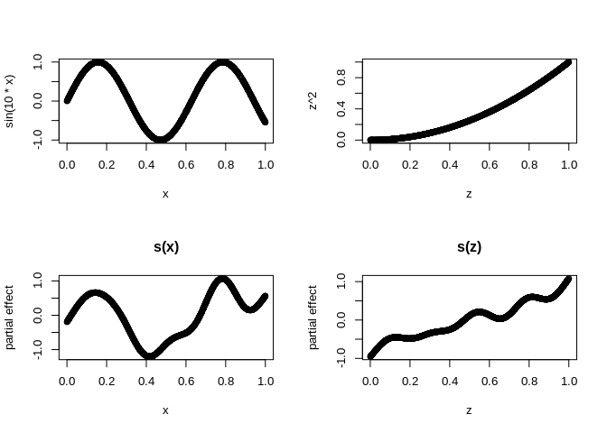<!-- -->

``` r
# get fitted values
meanpred <- mod %>% fitted()
par(mfrow=c(1,1))
plot(meanpred[,1] ~ x)
```

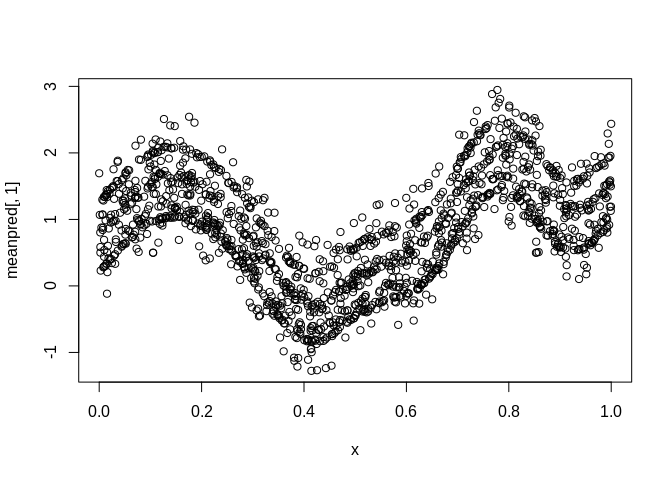<!-- -->

## Deep GAMLSS

We now extend the example 4 by a Deep model part.

``` r
set.seed(24)

# generate the data
n <- 1500
b0 <- 1

# training data; predictor 
x <- runif(n) %>% as.matrix()
z <- runif(n) %>% as.matrix()
true_mean_fun <- function(xx,zz) sin(10*xx) + zz^2 + b0
true_sd_fun <- function(xl) exp(2 * xl)
true_dgp_fun <- function(xx,zz)
{
  
  eps <- rnorm(n) * true_sd_fun(xx)
  y <- true_mean_fun(xx, zz) + eps
  return(y)
  
}

# compose training data with heteroscedastic errors
y <- true_dgp_fun(x,z)
data = data.frame(x = x, z = z)

# test data
x_test <- runif(n) %>% as.matrix()
z_test <- runif(n) %>% as.matrix()

validation_data = data.frame(x = x_test, z = z_test)

y_test <- true_dgp_fun(x_test, z_test)
#####################################################################

#####################################################################
# Define a Deep Model
# We use three hidden layers for the location:
deep_model <- function(x) x %>% 
  layer_dense(units = 128, activation = "relu", use_bias = FALSE) %>%
  layer_dense(units = 64, activation = "relu") %>%
  layer_dropout(rate = 0.2) %>%
  layer_dense(units = 32, activation = "relu") %>% 
  layer_dropout(rate = 0.2) %>%
  layer_dense(units = 8, activation = "relu") %>% 
  layer_dense(units = 1, activation = "linear")
#####################################################################

#####################################################################
# Initialize the model using the function
# provided in deepregression
mod <- deepregression(
  # supply data (response and data.frame for covariates)
  y = y,
  data = data,
  # define how parameters should be modeled
  list_of_formulae = list(loc = ~ 1 + s(x, bs="tp") + d(z),
                          scale = ~ 1 + x),
  list_of_deep_models = list(deep_model, NULL),
  # family normal
  family = "normal"
)
# fit model
mod %>% fit(epochs=500, verbose = FALSE, view_metrics = FALSE)
# plot model
mod %>% plot()
```

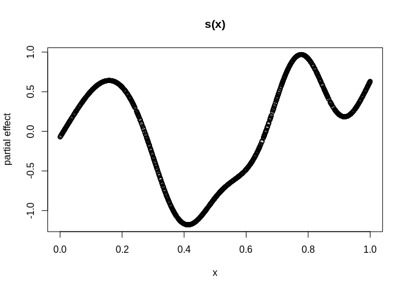<!-- -->

``` r
# get coefficients
mod %>% coef()
```

    ## $loc
    ## $loc$structured_nonlinear
    ##             [,1]
    ##  [1,]  0.2878227
    ##  [2,] -0.1259579
    ##  [3,] -0.2041069
    ##  [4,] -2.2595794
    ##  [5,] -0.9176710
    ##  [6,] -0.2325021
    ##  [7,]  0.4195509
    ##  [8,]  1.2403539
    ##  [9,] -0.5062242
    ## [10,]  0.2015388
    ## [11,]  2.0637753
    ## 
    ## 
    ## $scale
    ## $scale$structured_linear
    ##            [,1]
    ## [1,] 0.01116557
    ## [2,] 2.06416678

## Examples for each Distribution

In this example we just demonstrate all the distributions that can
currently be fitted using the deepregression framework. Updates will
happen quite frequently.

``` r
set.seed(24)

# generate the data
n <- 1500
b0 <- 1

# training data; predictor 
x <- runif(n) %>% as.matrix()
z <- runif(n) %>% as.matrix()
y <- runif(n) %>% as.matrix()
data = data.frame(x = x, z = z)

dists = 
c(
"normal", "bernoulli", "bernoulli_prob", 
"beta", "betar", "cauchy", "chi2", "chi","exponential",
"gamma", "gammar", "gumbel", "half_cauchy", "half_normal", "horseshoe",
"inverse_gamma", "inverse_gaussian", "laplace", "log_normal",
"logistic", "negbinom", "negbinom", "pareto", 
"poisson", "poisson_lograte", "student_t",
"student_t_ls", "uniform"
)
#####################################################################

#####################################################################
# check out if distributions work
#####################################################################
silent = TRUE
for(dist in dists)
{
  cat("Fitting", dist, "model... ")
  suppressWarnings(
    mod <- try(deepregression(
      y = y,
      data = data,
      # define how parameters should be modeled
      list_of_formulae = list(~ 1 + x, ~ 1 + z, ~ 1),
      list_of_deep_models = NULL,
      family = dist
    ), silent=silent)
  )
  # test if model can be fitted
  if(class(mod)=="try-error")
  {
    cat("Failed to initialize the model.\n")
    next
  }
  fitting <- try(
    res <- mod %>% fit(epochs=2, verbose = FALSE, view_metrics = FALSE),
    silent=silent
  )
  if(class(fitting)=="try-error"){ 
    cat("Failed to fit the model.\n")
  }else if(sum(is.nan(unlist(res$metrics))) > 0){
    cat("NaNs in loss or validation loss.\n")
  }else if(any(unlist(res$metrics)==Inf)){
    cat("Infinite values in loss or validation loss.\n")
  }else{
    # print(res$metrics)
    cat("Success.\n")
  }
}
```

    ## Fitting normal model... Success.
    ## Fitting bernoulli model... Success.
    ## Fitting bernoulli_prob model... Success.
    ## Fitting beta model... Success.
    ## Fitting betar model... Success.
    ## Fitting cauchy model... Success.
    ## Fitting chi2 model... Success.
    ## Fitting chi model... Success.
    ## Fitting exponential model... Success.
    ## Fitting gamma model... Success.
    ## Fitting gammar model... Success.
    ## Fitting gumbel model... Success.
    ## Fitting half_cauchy model... Infinite values in loss or validation loss.
    ## Fitting half_normal model... Success.
    ## Fitting horseshoe model... Success.
    ## Fitting inverse_gamma model... Success.
    ## Fitting inverse_gaussian model... Success.
    ## Fitting laplace model... Success.
    ## Fitting log_normal model... Success.
    ## Fitting logistic model... Success.
    ## Fitting negbinom model... Success.
    ## Fitting negbinom model... Success.
    ## Fitting pareto model... Infinite values in loss or validation loss.
    ## Fitting poisson model... Success.
    ## Fitting poisson_lograte model... Success.
    ## Fitting student_t model... Success.
    ## Fitting student_t_ls model... Success.
    ## Fitting uniform model... Infinite values in loss or validation loss.

## Real World Application

### Deep Mixed Model for Wage Panel Data

This example applies deep distributional regression to the ‘Cornwell and
Rupert’ data, a balanced panel dataset with 595 individuals and 4165
observations, where each individual is observed for 7 years. This data
set is also used in Tran et al. (2018) for within subject prediction of
the log of wage in the years 6 and 7 after training on years 1 to 5.
They report an MSE of
0.05.

``` r
data <- read.csv("http://people.stern.nyu.edu/wgreene/Econometrics/cornwell&rupert.csv")
data$ID <- as.factor(data$ID)

train <- data %>% filter(YEAR < 6)
test <- data %>% filter(YEAR >= 6)

deep_mod <- function(x) x %>% 
  layer_dense(units = 5, activation = "relu", use_bias = FALSE) %>%
  layer_dense(units = 5, activation = "relu") %>%
  layer_dense(units = 1, activation = "linear")

# expanding window CV
cv_folds <- list(#year1 = list(train = which(train$YEAR==1),
                #              test = which(train$YEAR>1 & train$YEAR<4)),
                 year2 = list(train = which(train$YEAR<=2),
                              test = which(train$YEAR>2 & train$YEAR<5)),
                 year3 = list(train = which(train$YEAR<=3),
                              test = which(train$YEAR>3 & train$YEAR<6)))

# initialize model
mod <- deepregression(y = train$LWAGE,
                      data = train[,c(1:11, 14, 16)], 
                      list_of_formulae = list(~ 1 + s(ID, bs="re") + 
                                                d(EXP, WKS, OCC, IND, SOUTH, YEAR,
                                                  SMSA, MS, FEM, UNION, ED, BLK),
                                              ~ 1),
                      list_of_deep_models = list(deep_mod),
                      family = "normal",
                      train_together = FALSE,
                      cv_folds = cv_folds
                        )

cvres <- mod %>% cv(epochs = 200)
```

    ## Fitting Fold  1  ... 
    ## Done in 24.35041  secs 
    ## Fitting Fold  2  ... 
    ## Done in 27.43032  secs

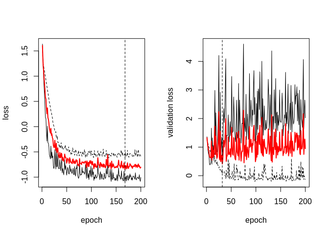<!-- -->

``` r
mod %>% fit(epochs = stop_iter_cv_result(cvres), view_metrics=FALSE)
pred <- mod %>% predict(test)

mean((pred-test$LWAGE)^2)
```

    ## [1] 0.03855939

### Deep Quantile Regression on Motorcycle Data

``` r
#### Apply deep distributional regression to 
#### Silverman's Motorcycle data, 
#### and use distributional regression to compare
#### with quantile regression
library(MASS)
data("mcycle")
set.seed(48)

res = data.frame(RMSE = NA, time = NA)

nrsims <- 20

best_rmse <- Inf

for(sim_iteration in 1:nrsims){
  
  train_ind <- sample(1:nrow(mcycle), 90)
  train <- mcycle[train_ind,]
  test <- mcycle[setdiff(1:nrow(mcycle),train_ind),]
  
  deep_mod <- function(x) x %>% 
    layer_dense(units = 50, activation = "tanh", use_bias = TRUE) %>%
    layer_dense(units = 10, activation = "linear") %>%
    layer_dense(units = 1, activation = "linear")
  
  mod_deep <- deepregression(y = train$accel, 
                             list_of_formulae = list(loc = ~ 0 + d(times),
                                                     scale = ~ 1 + times),
                             list_of_deep_models = list(deep_mod, NULL),
                             data = train,
                             train_together = FALSE,
                             family = "normal",
                             cv_folds = 10)
  
  st <- Sys.time()
  
  mod_deep %>% fit(epochs = 5000, view_metrics=FALSE)
  
  et <- Sys.time()
  
  pred <- mod_deep %>% predict(test)
  
  rmse <- sqrt(mean((pred-test$accel)^2))
  
  if(!is.nan(rmse) && best_rmse > rmse){
    
    #### get mean and quantiles
    mean <- mod_deep %>% mean(data = mcycle)
    q40 <- mod_deep %>% quantile(data = mcycle, value = 0.4)
    q60 <- mod_deep %>% quantile(data = mcycle, value = 0.6)
    q10 <- mod_deep %>% quantile(data = mcycle, value = 0.1)
    q90 <- mod_deep %>% quantile(data = mcycle, value = 0.9)
    
    #### for plotting
    fitdf <- cbind(mcycle, data.frame(mean = mean,
                                      q40 = q40,
                                      q60 = q60,
                                      q10 = q10,
                                      q90 = q90)
    )
    
    best_rmse <- rmse
    
  }
  
  res[sim_iteration, ] <- c(rmse, as.numeric(difftime(et,st,units="mins")))
  
}

# get performance and times
apply(res, 2, function(x) c(mean(x, na.rm=T), sd(x, na.rm=T)))
```

    ##          RMSE      time
    ## [1,] 37.45039 0.9263288
    ## [2,] 15.50161 0.0353964

``` r
library(reshape2)
library(ggplot2)

fitdf %>% 
  ggplot() + 
  geom_point(aes(x=times, y=accel)) + 
  geom_line(aes(x=times, y=mean), col="red", linetype = 1) + 
  geom_line(aes(x=times, y=q40), col="red", linetype = 2) + 
  geom_line(aes(x=times, y=q60), col="red", linetype = 2) + 
  geom_line(aes(x=times, y=q10), col="red", linetype = 3) + 
  geom_line(aes(x=times, y=q90), col="red", linetype = 4) + theme_bw()
```

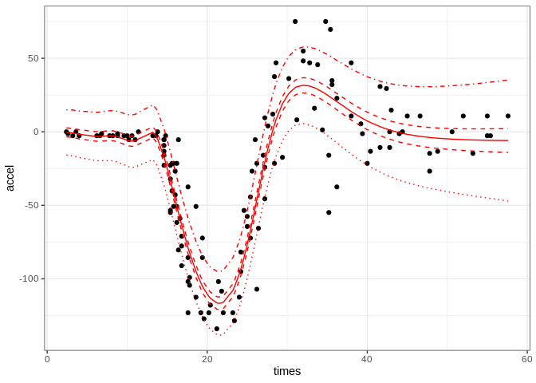<!-- -->

### High-Dimensional Ridge and Lasso Regression

This examples shows how we can seamlessly employ the software to fit
high-dimensional Ridge and Lasso Regression with 2000 covariates with
just 42 observations.

``` r
data <- read.table("data/colon-cancer")
colnames(data) <- c("outcome", paste0("X", 1:2000))
data[,-1] <- lapply(data[,-1], function(x) as.numeric(gsub("\\d+:","",x)))
data$outcome <- as.numeric(data$outcome > 0)

c(train_ind, test_ind) %<-% list(1:42, 42+1:20)

train <- data[train_ind,]
test <- data[test_ind,]

# use Ridge penalty
form <- as.formula(paste0("~ s(", 
                          paste(colnames(train)[-1],
                                collapse=",bs='re') + s("),
                          ",bs='re')"))

mod <- deepregression(y = train$outcome[train_ind],
                      data = train[,-1],
                      list_of_formulae = 
                        list(logit = form),
                      family = "bernoulli",
                      list_of_deep_models = NULL,
                      cv_folds = 14,
                      df=0.1)

cvres <- mod %>% cv(epochs = 100)
```

    ## Fitting Fold  1  ... 
    ## Done in 6.120511  mins 
    ## Fitting Fold  2  ... 
    ## Done in 6.452453  mins 
    ## Fitting Fold  3  ... 
    ## Done in 6.573855  mins 
    ## Fitting Fold  4  ... 
    ## Done in 6.590473  mins 
    ## Fitting Fold  5  ... 
    ## Done in 6.275715  mins 
    ## Fitting Fold  6  ... 
    ## Done in 6.020251  mins 
    ## Fitting Fold  7  ... 
    ## Done in 6.031105  mins 
    ## Fitting Fold  8  ... 
    ## Done in 6.026873  mins 
    ## Fitting Fold  9  ... 
    ## Done in 6.041285  mins 
    ## Fitting Fold  10  ... 
    ## Done in 5.996561  mins 
    ## Fitting Fold  11  ... 
    ## Done in 6.119858  mins 
    ## Fitting Fold  12  ... 
    ## Done in 6.032337  mins 
    ## Fitting Fold  13  ... 
    ## Done in 6.056118  mins 
    ## Fitting Fold  14  ... 
    ## Done in 6.058609  mins

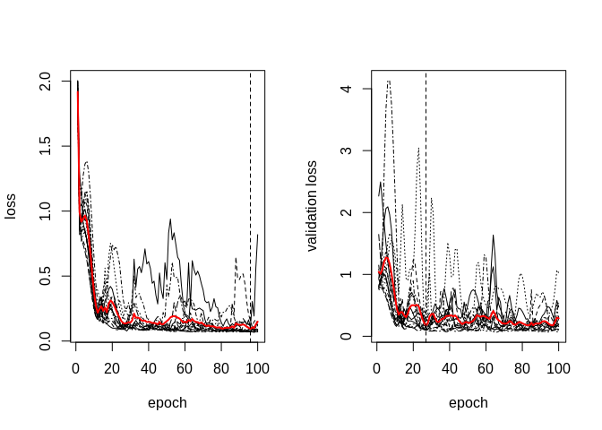<!-- -->

``` r
mod %>% fit(epochs = stop_iter_cv_result(cvres),
            validation_split = NULL, view_metrics = FALSE)
coef <- mod %>% coef()
summary(coef[[1]][[1]])
```

    ##        V1            
    ##  Min.   :-0.3595438  
    ##  1st Qu.:-0.0059966  
    ##  Median :-0.0006256  
    ##  Mean   :-0.0004537  
    ##  3rd Qu.: 0.0047528  
    ##  Max.   : 0.0277284

``` r
pred <- mod %>% predict(newdata = test[,-1])
boxplot(pred ~ test$outcome)

### fit with Lasso
form <- as.formula(paste0("~ ", 
                          paste(colnames(train)[-1],
                                collapse=" + ")))

mod <- deepregression(y = train$outcome[train_ind],
                      data = train[,-1],
                      list_of_formulae = 
                        list(logit = form),
                      family = "bernoulli",
                      lambda_lasso = 0.1,
                      list_of_deep_models = NULL,
                      cv_folds = 14)

cvres <- mod %>% cv(epochs = 100)
```

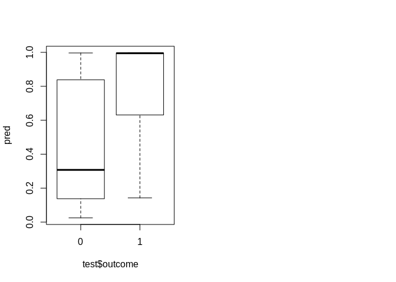<!-- -->

    ## Fitting Fold  1  ... 
    ## Done in 4.83892  secs 
    ## Fitting Fold  2  ... 
    ## Done in 4.023231  secs 
    ## Fitting Fold  3  ... 
    ## Done in 4.414994  secs 
    ## Fitting Fold  4  ... 
    ## Done in 4.908429  secs 
    ## Fitting Fold  5  ... 
    ## Done in 4.583536  secs 
    ## Fitting Fold  6  ... 
    ## Done in 3.946018  secs 
    ## Fitting Fold  7  ... 
    ## Done in 4.292011  secs 
    ## Fitting Fold  8  ... 
    ## Done in 4.609456  secs 
    ## Fitting Fold  9  ... 
    ## Done in 3.889753  secs 
    ## Fitting Fold  10  ... 
    ## Done in 4.211881  secs 
    ## Fitting Fold  11  ... 
    ## Done in 4.62217  secs 
    ## Fitting Fold  12  ... 
    ## Done in 5.023367  secs 
    ## Fitting Fold  13  ... 
    ## Done in 4.757053  secs 
    ## Fitting Fold  14  ... 
    ## Done in 3.917783  secs

<!-- -->

``` r
mod %>% fit(epochs = stop_iter_cv_result(cvres),
            validation_split = NULL, view_metrics = FALSE)
coef <- mod %>% coef()

pred <- mod %>% predict(newdata = test[,-1])
boxplot(pred ~ test$outcome)
plot(coef[[1]][[1]])
```

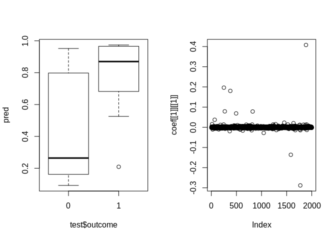<!-- -->

## Mixture of normals

We here estimate a mixture of three normal distributions for the acidity
data, a data set showing the acidity index for 155 lakes in the
Northeastern United States.

``` r
# load data
library("gamlss.data")
data(acidity)

# softmax function
logsumexp <- function (x) {
  y = max(x)
  y + log(sum(exp(x - y)))
}
softmax <- function (x) {
  exp(x - logsumexp(x))
}


mod <- deepregression(acidity$y-mean(acidity$y), 
                      list_of_formulae = list(~ 1, #mixtures
                                              ~1, ~1, ~1, # means
                                              ~1, ~1, ~1 # sds
                      ),
                      data = acidity,
                      list_of_deep_models = NULL, 
                      mixture_dist = 3,
                      dist_fun = mix_dist_maker())


cvres <- mod %>% cv(epochs = 500, cv_folds = 5)
```

    ## Fitting Fold  1  ... 
    ## Done in 25.24153  secs 
    ## Fitting Fold  2  ... 
    ## Done in 23.01146  secs 
    ## Fitting Fold  3  ... 
    ## Done in 22.45995  secs 
    ## Fitting Fold  4  ... 
    ## Done in 22.52778  secs 
    ## Fitting Fold  5  ... 
    ## Done in 22.84135  secs

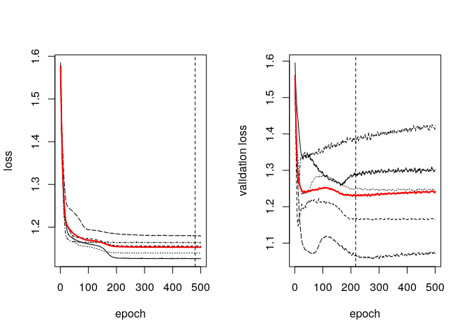<!-- -->

``` r
mod %>% fit(epochs = stop_iter_cv_result(cvres), 
            validation_split = NULL, view_metrics = FALSE)
coefinput <- unlist(mod$model$get_weights())
(means <- coefinput[c(2:4)])
```

    ## [1] -0.8807158  1.3250959 -0.1820126

``` r
(stds <- exp(coefinput[c(5:7)]))
```

    ## [1] 0.2337661 0.3969661 0.7143496

``` r
(pis <- softmax(coefinput[8:10]*coefinput[1]))
```

    ## [1] 0.4059310 0.3063351 0.2877339

``` r
library(distr)

mixDist <- UnivarMixingDistribution(Norm(means[1],stds[1]),
                                    Norm(means[2],stds[2]),
                                    Norm(means[3],stds[3]),
                                    mixCoeff=pis)

plot(mixDist, to.draw.arg="d", ylim=c(0,1.4)) 
with(acidity, hist(y-mean(y), breaks = 100, add=TRUE, freq = FALSE))
```

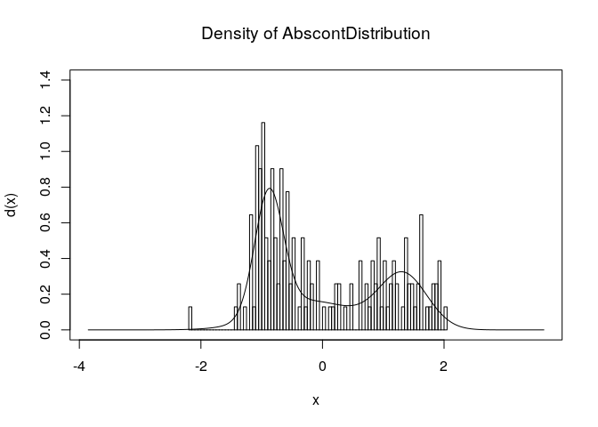<!-- -->

# Unstructured Data Examples

## MNIST zeros

``` r
mnist <- dataset_mnist()
x_train <- mnist$train$x
y_train <- mnist$train$y
x_test <- mnist$test$x
y_test <- mnist$test$y

# reshape
dim(x_train) <- c(nrow(x_train), 784)
dim(x_test) <- c(nrow(x_test), 784)
# rescale
x_train <- x_train / 255
x_test <- x_test / 255
# convert to data.frame
x_train <- as.data.frame(x_train)
x_test <- as.data.frame(x_test)
y_train <- as.integer(y_train==0)
y_test <- as.integer(y_test==0)

# deep model
nn_model <- function(x) x %>%
  layer_dense(units = 256, activation = "relu", input_shape = c(784)) %>%
  layer_dropout(rate = 0.4) %>%
  layer_dense(units = 128, activation = "relu") %>%
  layer_dropout(rate = 0.3) %>%
  layer_dense(units = 1)


mod <- deepregression(y = y_train,
                      list_of_formulae = list(logit = ~ 0 + nn_model(.)),
                      list_of_deep_models = list(nn_model = nn_model),
                      data = x_train,
                      family = "bernoulli")

# model does not need to have many epochs as 
# the 0 is easily detected using some specific pixels
mod %>% fit(epochs = 5, view_metrics=FALSE)
pred <- mod %>% predict(x_test)
boxplot(pred ~ y_test, ylab="Predicted Probability", xlab = "True Label")
```

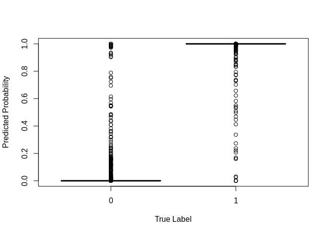<!-- -->

## MNIST Multinomial

The non-binarized MNIST example demonstrates the capabilities of the
framework to handle multinomial (or in general multivariate) responses.

``` r
mnist <- dataset_mnist()
x_train <- mnist$train$x
y_train <- mnist$train$y
x_test <- mnist$test$x
y_test <- mnist$test$y

# reshape
dim(x_train) <- c(nrow(x_train), 784)
dim(x_test) <- c(nrow(x_test), 784)
# rescale
x_train <- x_train / 255
x_test <- x_test / 255
# convert to data.frame
x_train <- as.data.frame(x_train)
x_test <- as.data.frame(x_test)
y_train <- to_categorical(y_train)
y_test <- to_categorical(y_test)

# deep model
nn_model <- function(x) x %>%
  layer_dense(units = 256, activation = "relu", input_shape = c(784)) %>%
  layer_dropout(rate = 0.4) %>%
  layer_dense(units = 128, activation = "relu") %>%
  layer_dropout(rate = 0.3) %>%
  layer_dense(units = 10)


mod <- deepregression(y = y_train,
                      list_of_formulae = list(logit = ~ 0 + d(.)),
                      list_of_deep_models = list(nn_model),
                      data = x_train,
                      family = "multinomial")

# model does not need to have many epochs as 
# the 0 is easily detected using some specific pixels
cvres <- mod %>% fit(epochs = 50, validation_split = NULL, steps_per_epoch=1,
                     view_metrics = FALSE)
# currenty has some issues when using actual batch training,
# see also: https://github.com/keras-team/keras/issues/11749
pred <- mod %>% predict(x_test)
table(data.frame(pred=apply(pred,1,which.max)-1, 
                 truth=apply(y_test, 1, function(x) which(x==1))-1
                 )
      )
```

    ##     truth
    ## pred    0    1    2    3    4    5    6    7    8    9
    ##    0  970    0   10    0    1    2    8    2    6    5
    ##    1    0 1120    0    0    0    0    3    7    1    5
    ##    2    1    3  989    9    8    0    1   12    8    0
    ##    3    1    2    4  975    0   15    1    1   10   12
    ##    4    0    0    3    0  952    1    6    1    4   19
    ##    5    2    1    2    8    0  856    8    0   10    4
    ##    6    4    2    5    1    6    9  928    0    6    0
    ##    7    1    0    8    8    2    1    0  994    6    5
    ##    8    1    7    9    8    2    4    3    0  921    4
    ##    9    0    0    2    1   11    4    0   11    2  955

## Text as Input

We use IMDB Reviews for sentiment analysis to predict 1 = positive or 0
= negative reviews. The example is taken from the [Tensorflow
Blog](https://blogs.rstudio.com/tensorflow/posts/2017-12-07-text-classification-with-keras/)
but just a small example with 1000 words.

``` r
nr_words = 1000
imdb <- dataset_imdb(num_words = nr_words)
train_data <- imdb$train$x
train_labels <- imdb$train$y
test_data <- imdb$test$x
test_labels <- imdb$test$y

word_index <- dataset_imdb_word_index()  
reverse_word_index <- names(word_index)
names(reverse_word_index) <- word_index

decoded_review <- sapply(train_data[[1]], function(index) {
  word <- if (index >= 3) reverse_word_index[[as.character(index - 3)]]
  if (!is.null(word)) word else "[...]"
})
cat(decoded_review[2:87])
```

    ## this film was just brilliant casting [...] [...] story direction [...] really [...] the part they played and you could just imagine being there robert [...] is an amazing actor and now the same being director [...] father came from the same [...] [...] as myself so i loved the fact there was a real [...] with this film the [...] [...] throughout the film were great it was just brilliant so much that i [...] the film as soon as it was released for [...]

Do the actual pre-processing and model fitting

``` r
vectorize_sequences <- function(sequences, dimension = nr_words) {
  results <- matrix(0, nrow = length(sequences), ncol = dimension) 
  for (i in 1:length(sequences))
    results[i, sequences[[i]]] <- 1 
  results
}

x_train <- vectorize_sequences(train_data)
x_test <- vectorize_sequences(test_data)
y_train <- as.numeric(train_labels)
y_test <- as.numeric(test_labels)

# this is how a bidirectional LSTM would look like
# nn_model <- function(x) x %>%
#   layer_embedding(input_dim = nr_words, 
#                   # embedding dimension = 2
#                   # as an example -> yields
#                   # 100*nr_words parameters
#                   # to be estimated
#                   output_dim = 100) %>% 
#   bidirectional(layer = layer_lstm(units = 64)) %>%
#   layer_dense(1)
#
# -> not appropriate here, as we have a simple
# classification task

nn_model <- function(x) x %>% 
  layer_dense(units = 5, activation = "relu", input_shape = c(nr_words)) %>% 
  layer_dense(units = 5, activation = "relu") %>% 
  layer_dense(units = 1, activation = "linear")

mod <- deepregression(y = y_train,
                      list_of_formulae = list(logit = ~ 0 + d(.)),
                      list_of_deep_models = list(nn_model),
                      data = as.data.frame(x_train),
                      family = "bernoulli")

# as an example only use 3 epochs (lstms usualy need 
# not so many epochs anyway)
mod %>% fit(epochs = 20, view_metrics=FALSE, batch_size = 500)
pred <- mod %>% predict(as.data.frame(x_test))
boxplot(pred ~ y_test,  ylab="Predicted Probability", xlab = "True Label")
```

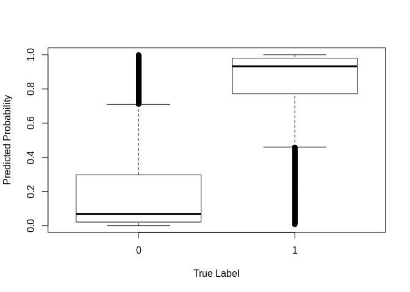<!-- -->

## Zero-inflated Poisson Distribution

An example how to fit an access the ZIP distribution. We first create
data and add some dummy covariates.

``` r
# create data
n <- 5000
prob = 0.3
lambda = 2
  
bino <- rbinom(n, size = 1, prob = prob)
y <- 0 * bino + (1-bino) * rpois(n, lambda)
data = data.frame(y=y, x = rnorm(n))
```

Now we fit the distribution and access the fitted parameters

``` r
mod <- deepregression(y, 
                      list_of_formulae = list(rate = ~ 1 + x, 
                                              prob = ~1),
                      data = data,
                      list_of_deep_models = NULL, 
                      family = "zip")
# fit the model
mod %>% fit(epochs = 50, view_metrics=FALSE)

# get distribution
mydist <- mod %>% get_distribution(data = data)

# rate for Poisson
mydist$components[[1]]$rate
```

    ## tf.Tensor(
    ## [[1.9182708]
    ##  [1.9782604]
    ##  [2.000047 ]
    ##  ...
    ##  [2.0756662]
    ##  [1.9315189]
    ##  [1.9416286]], shape=(5000, 1), dtype=float32)

``` r
# probability for inflation / non-inflation
mydist$cat$probs
```

    ## tf.Tensor(
    ## [[[0.6805297 0.3194703]]
    ## 
    ##  [[0.6805297 0.3194703]]
    ## 
    ##  [[0.6805297 0.3194703]]
    ## 
    ##  ...
    ## 
    ##  [[0.6805297 0.3194703]]
    ## 
    ##  [[0.6805297 0.3194703]]
    ## 
    ##  [[0.6805297 0.3194703]]], shape=(5000, 1, 2), dtype=float32)
