deepregression
==============

Fitting Semistructured Deep Distributional Models in R

Installation
============

Since the repository is still private, clone the repository to your local machine and run the following

``` r
library(devtools)
load_all("R")
```

    ## Loading deepregression

Also make sure you have installed all the dependencies:

-   Matrix
-   dplyr
-   keras
-   mgcv
-   reticulate
-   tensorflow
-   tfprobability

In the future, the package can be installed as follows:

To install the latest version of deepregression:

``` r
library(devtools)
install_github("davidruegamer/deepregression")
```

Examples
========

1.  [Deep Linear Regression](#deep-linear-regression)
2.  [Deep Logistic Regression](#deep-logistic-regression)
3.  [Deep GAM](#deep-gam)
4.  [GAMLSS](#gamlss)
5.  [Deep GAMLSS](#deep-gamlss)
6.  [Examples for each Distribution](#examples-for-each-distribution)
7.  [Real World Applications](#real-world-applications)
    1.  [Deep Mixed Model for Wage Panel Data](#deep-mixed-model-for-wage-panel-data)
    2.  [Deep Quantile Regression on Motorcycle Data](#deep-quantile-regression-on-motorcycle-data)
    3.  [High-Dimensional Ridge and Lasso Regression on Colon Cancer Data](#high-dimensional-ridge-and-lasso-regression)

Deep Linear Regression
----------------------

We first create a very simple linear regression first where we try to model the non-linear part of the data generating process using a complex neural network and an intercept using a structured linear part.

``` r
set.seed(24)

# generate the data
n <- 1500
b0 <- 1

# training data; predictor 
x <- runif(n) %>% as.matrix()
true_mean_fun <- function(xx) sin(10*xx) + b0

# training data
y <- true_mean_fun(x) + rnorm(n = n, mean = 0, sd = 2)

data = data.frame(x = x)

# test data
x_test <- runif(n) %>% as.matrix()

validation_data = data.frame(x = x_test)

y_test <- true_mean_fun(x_test) + rnorm(n = n, sd = 2)
#####################################################################

#####################################################################
# Define a Deep Model
# We use three hidden layers for the location:
deep_model <- function(x) x %>% 
  layer_dense(units = 256, activation = "relu", use_bias = FALSE) %>%
  layer_dense(units = 128, activation = "relu") %>%
  layer_dropout(rate = 0.2) %>%
  layer_dense(units = 64, activation = "relu") %>% 
  layer_dropout(rate = 0.2) %>%
  layer_dense(units = 16, activation = "relu") %>% 
  layer_dense(units = 1, activation = "linear")
#####################################################################

#####################################################################
# Initialize the model using the function
# provided in deepregression
mod <- deepregression(
  # supply data (response and data.frame for covariates)
  y = y,
  data = data,
  # define how parameters should be modeled
  list_of_formulae = list(loc = ~ 1 + d(x), scale = ~1),
  list_of_deep_models = list(deep_model, NULL)
)
# fit model (may take a few minutes)
mod %>% fit(epochs=1000, verbose = FALSE, view_metrics = FALSE)
# predict
mean <- mod %>% fitted()
true_mean <- true_mean_fun(x)

# compare means
plot(true_mean ~ x, ylab="partial effect")
points(c(as.matrix(mean)) ~ x, col = "red")
legend("bottomright", col=1:2, pch = 1, legend=c("true mean", "deep prediction"))
```

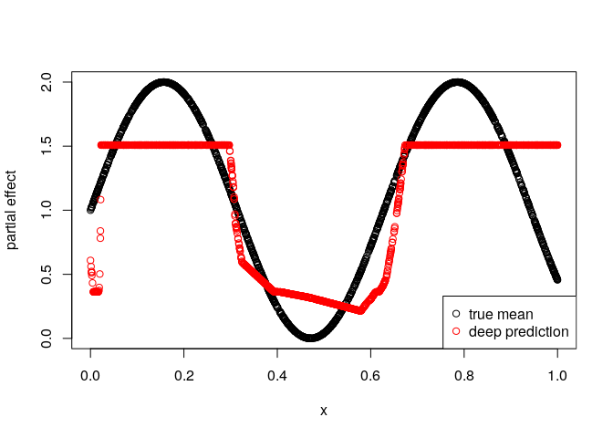

Deep GAM
--------

We now create a very simple logistic additive regression first where we try to model the non-linear part of the data generating process using both a complex neural network and a spline.

``` r
set.seed(24)

# generate the data
n <- 1500
b0 <- 1

# training data; predictor 
x <- runif(n) %>% as.matrix()
true_mean_fun <- function(xx) plogis(sin(10*xx) + b0)

# training data
y <- rbinom(n = n, size = 1, prob = true_mean_fun(x))

data = data.frame(x = x)

# test data
x_test <- runif(n) %>% as.matrix()

validation_data = data.frame(x = x_test)

y_test <- rbinom(n = n, size = 1, prob = true_mean_fun(x_test))
#####################################################################

#####################################################################
# Define a Deep Model
# We use three hidden layers for the location:
deep_model <- function(x) x %>% 
  layer_dense(units = 128, activation = "relu", use_bias = FALSE) %>%
  layer_dense(units = 64, activation = "relu") %>%
  layer_dropout(rate = 0.2) %>%
  layer_dense(units = 32, activation = "relu") %>% 
  layer_dropout(rate = 0.2) %>%
  layer_dense(units = 8, activation = "relu") %>% 
  layer_dense(units = 1, activation = "linear")
#####################################################################

#####################################################################
# Initialize the model using the function
# provided in deepregression
mod <- deepregression(
  # supply data (response and data.frame for covariates)
  y = y,
  data = data,
  # define how parameters should be modeled
  list_of_formulae = list(logits = ~ 1 + s(x, bs = "tp") + d(x)),
  list_of_deep_models = list(deep_model),
  # family binomial n=1
  family = "bernoulli",
  df = 10 # use no penalization for spline
)
# fit model, save weights
history <- mod %>% fit(epochs=100, verbose = FALSE, view_metrics = FALSE,
                       save_weights = TRUE)

# plot history of spline
BX <- mod$init_params$parsed_formulae_contents[[1]][[2]]$x$X
coef_history <- history$weighthistory[-1,]
f_history <- sapply(1:ncol(coef_history), function(j) BX%*%coef_history[,j])
library(ggplot2)
library(reshape2)
df <- melt(cbind(x=x, as.data.frame(f_history)), id.vars="x")
df$variable = as.numeric(df$variable)
ggplot(df, aes(x=x,y=value, colour=as.integer(variable), group=factor(variable))) + 
  geom_line() + 
  scale_colour_gradient(name = "epoch", 
                        low = "blue", high = "red") + 
  ylab("partial effect s(x)") + theme_bw()
```

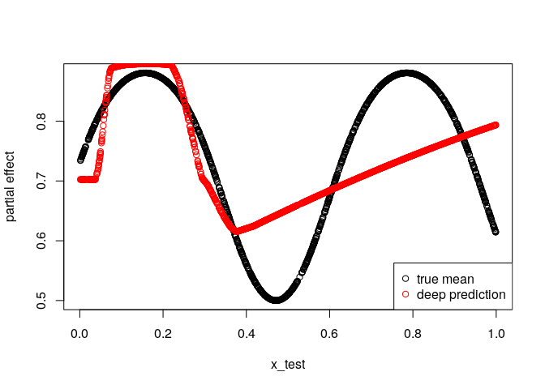

We can check which of the function the cross-validation would have chosen by doing the following:

``` r
mod <- deepregression(
  # supply data (response and data.frame for covariates)
  y = y,
  data = data,
  # define how parameters should be modeled
  list_of_formulae = list(logits = ~ 1 + s(x, bs = "tp") + d(x)),
  list_of_deep_models = list(deep_model),
  # family binomial n=1
  family = "bernoulli",
  df = 10 # use no penalization for spline
)

cvres <- mod %>% cv(epochs=100)
```

    ## Warning in cv(., epochs = 100): No folds for CV given, using k = 10.

    ## Fitting Fold  1  ... 
    ## Done in 1.106532  mins 
    ## Fitting Fold  2  ... 
    ## Done in 58.70751  secs 
    ## Fitting Fold  3  ... 
    ## Done in 1.059248  mins 
    ## Fitting Fold  4  ... 
    ## Done in 56.1083  secs 
    ## Fitting Fold  5  ... 
    ## Done in 1.030083  mins 
    ## Fitting Fold  6  ... 
    ## Done in 59.16519  secs 
    ## Fitting Fold  7  ... 
    ## Done in 56.98158  secs 
    ## Fitting Fold  8  ... 
    ## Done in 1.011547  mins 
    ## Fitting Fold  9  ... 
    ## Done in 57.27924  secs 
    ## Fitting Fold  10  ... 
    ## Done in 59.32187  secs

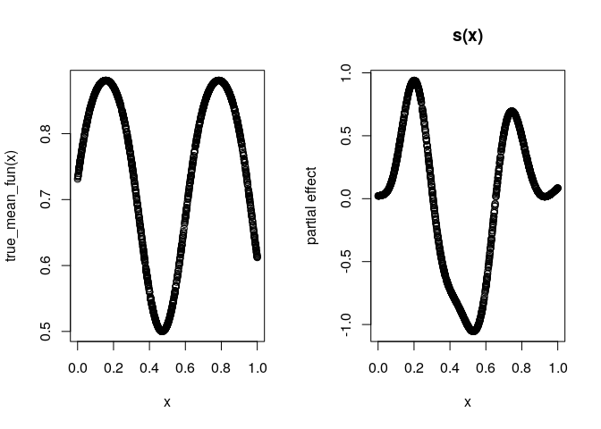

Get the optimal stopping iteration and train the whole model again:

``` r
bestiter <- stop_iter_cv_result(cvres)
mod <- deepregression(
  # supply data (response and data.frame for covariates)
  y = y,
  data = data,
  # define how parameters should be modeled
  list_of_formulae = list(logits = ~ 1 + s(x, bs = "tp") + d(x)),
  list_of_deep_models = list(deep_model),
  # family binomial n=1
  family = "bernoulli",
  validation_split = NULL,
  df = 10 # use no penalization for spline
)
# fit model
history <- mod %>% fit(epochs=bestiter, verbose = FALSE, view_metrics = FALSE,
                       save_weights = TRUE)
# plot model
par(mfrow=c(1,2))
plot(true_mean_fun(x) ~ x)
mod %>% plot()
```

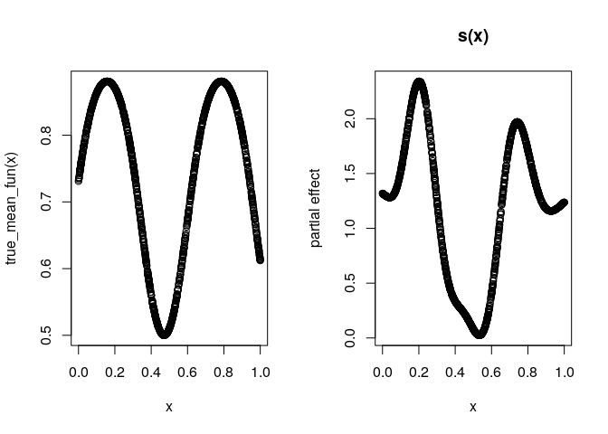

GAMLSS
------

We not create a standard GAMLSS model with Gaussian distribution by modeling the expectation using additive terms and the standard deviation by a linear term.

``` r
set.seed(24)

# generate the data
n <- 1500
b0 <- 1

# training data; predictor 
x <- runif(n) %>% as.matrix()
z <- runif(n) %>% as.matrix()
true_mean_fun <- function(xx,zz) sin(10*xx) + zz^2 + b0
true_sd_fun <- function(xl) exp(2 * xl)
true_dgp_fun <- function(xx,zz)
{
  
  eps <- rnorm(n) * true_sd_fun(xx)
  y <- true_mean_fun(xx, zz) + eps
  return(y)
  
}

# compose training data with heteroscedastic errors
y <- true_dgp_fun(x,z)
data = data.frame(x = x, z = z)

# test data
x_test <- runif(n) %>% as.matrix()
z_test <- runif(n) %>% as.matrix()

validation_data = data.frame(x = x_test, z = z_test)

y_test <- true_dgp_fun(x_test, z_test)
#####################################################################

#####################################################################
# Define a Deep Model
# We use three hidden layers for the location:
deep_model <- function(x) x %>% 
  layer_dense(units = 128, activation = "relu", use_bias = FALSE) %>%
  layer_dense(units = 64, activation = "relu") %>%
  layer_dropout(rate = 0.2) %>%
  layer_dense(units = 32, activation = "relu") %>% 
  layer_dropout(rate = 0.2) %>%
  layer_dense(units = 8, activation = "relu") %>% 
  layer_dense(units = 1, activation = "linear")
#####################################################################

#####################################################################
# Initialize the model using the function
# provided in deepregression
mod <- deepregression(
  # supply data (response and data.frame for covariates)
  y = y,
  data = data,
  # define how parameters should be modeled
  list_of_formulae = list(loc = ~ 1 + s(x, bs="tp") + s(z, bs="tp"),
                          scale = ~ 0 + x),
  list_of_deep_models = list(NULL, deep_model),
  # family binomial n=1
  family = "normal",
  df = 10
)
# fit model
mod %>% fit(epochs=2000, verbose = FALSE, view_metrics = FALSE)
# summary(mod)
# coefficients
mod %>% coef()
```

    ## $loc
    ## $loc$structured_nonlinear
    ##              [,1]
    ##  [1,]  0.12405325
    ##  [2,]  0.34915704
    ##  [3,] -0.43325099
    ##  [4,] -2.53684711
    ##  [5,] -0.88108808
    ##  [6,] -0.08886056
    ##  [7,]  0.50256222
    ##  [8,]  1.27701235
    ##  [9,] -0.85285914
    ## [10,]  0.79324198
    ## [11,]  2.61382842
    ## [12,]  0.90732944
    ## [13,] -0.63104922
    ## [14,]  0.12836085
    ## [15,] -0.24578108
    ## [16,] -0.31313276
    ## [17,]  0.21098958
    ## [18,] -0.31738567
    ## [19,] -0.67330980
    ## [20,]  0.68586659
    ## [21,]  1.90825808
    ## 
    ## 
    ## $scale
    ## $scale$structured_linear
    ##          [,1]
    ## [1,] 2.044245

``` r
# plot model
par(mfrow=c(2,2))
plot(sin(10*x) ~ x)
plot(z^2 ~ z)
mod %>% plot()
```


``` r
# get fitted values
meanpred <- mod %>% fitted()
par(mfrow=c(1,1))
plot(meanpred[,1] ~ x)
```

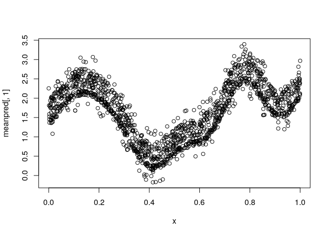

Deep GAMLSS
-----------

We now extend the example 4 by a Deep model part.

``` r
set.seed(24)

# generate the data
n <- 1500
b0 <- 1

# training data; predictor 
x <- runif(n) %>% as.matrix()
z <- runif(n) %>% as.matrix()
true_mean_fun <- function(xx,zz) sin(10*xx) + zz^2 + b0
true_sd_fun <- function(xl) exp(2 * xl)
true_dgp_fun <- function(xx,zz)
{
  
  eps <- rnorm(n) * true_sd_fun(xx)
  y <- true_mean_fun(xx, zz) + eps
  return(y)
  
}

# compose training data with heteroscedastic errors
y <- true_dgp_fun(x,z)
data = data.frame(x = x, z = z)

# test data
x_test <- runif(n) %>% as.matrix()
z_test <- runif(n) %>% as.matrix()

validation_data = data.frame(x = x_test, z = z_test)

y_test <- true_dgp_fun(x_test, z_test)
#####################################################################

#####################################################################
# Define a Deep Model
# We use three hidden layers for the location:
deep_model <- function(x) x %>% 
  layer_dense(units = 128, activation = "relu", use_bias = FALSE) %>%
  layer_dense(units = 64, activation = "relu") %>%
  layer_dropout(rate = 0.2) %>%
  layer_dense(units = 32, activation = "relu") %>% 
  layer_dropout(rate = 0.2) %>%
  layer_dense(units = 8, activation = "relu") %>% 
  layer_dense(units = 1, activation = "linear")
#####################################################################

#####################################################################
# Initialize the model using the function
# provided in deepregression
mod <- deepregression(
  # supply data (response and data.frame for covariates)
  y = y,
  data = data,
  # define how parameters should be modeled
  list_of_formulae = list(loc = ~ 1 + s(x, bs="tp") + d(z),
                          scale = ~ 1 + x),
  list_of_deep_models = list(deep_model, NULL),
  # family normal
  family = "normal"
)
# fit model
mod %>% fit(epochs=500, verbose = FALSE, view_metrics = FALSE)
# plot model
mod %>% plot()
```


``` r
# get coefficients
mod %>% coef()
```

    ## $loc
    ## $loc$structured_nonlinear
    ##              [,1]
    ##  [1,]  0.69442630
    ##  [2,]  0.16980447
    ##  [3,] -0.08358414
    ##  [4,] -2.22142458
    ##  [5,] -0.95123333
    ##  [6,] -0.31805530
    ##  [7,]  0.35845891
    ##  [8,]  1.07993603
    ##  [9,] -0.28049165
    ## [10,]  0.31339967
    ## [11,]  1.76369333
    ## 
    ## 
    ## $scale
    ## $scale$structured_linear
    ##            [,1]
    ## [1,] -0.6702456
    ## [2,]  2.0083926

Examples for each Distribution
------------------------------

In this example we just demonstrate all the distributions that can currently be fitted using the deepregression framework. Updates will happen quite frequently.

``` r
set.seed(24)

# generate the data
n <- 1500
b0 <- 1

# training data; predictor 
x <- runif(n) %>% as.matrix()
z <- runif(n) %>% as.matrix()
y <- runif(n) %>% as.matrix()
data = data.frame(x = x, z = z)

dists = 
c(
"normal", "bernoulli", "bernoulli_prob", 
"beta", "betar", "cauchy", "chi2", "chi","exponential",
"gamma", "gammar", "gumbel", "half_cauchy", "half_normal", "horseshoe",
"inverse_gamma", "inverse_gaussian", "laplace", "log_normal",
"logistic", "negbinom", "negbinom", "pareto", 
"poisson", "poisson_lograte", "student_t",
"student_t_ls", "uniform"
)
#####################################################################

#####################################################################
# check out if distributions work
#####################################################################
silent = TRUE
for(dist in dists)
{
  cat("Fitting", dist, "model... ")
  suppressWarnings(
    mod <- try(deepregression(
      y = y,
      data = data,
      # define how parameters should be modeled
      list_of_formulae = list(~ 1 + x, ~ 1 + z, ~ 1),
      list_of_deep_models = NULL,
      family = dist
    ), silent=silent)
  )
  # test if model can be fitted
  if(class(mod)=="try-error")
  {
    cat("Failed to initialize the model.\n")
    next
  }
  fitting <- try(
    res <- mod %>% fit(epochs=2, verbose = FALSE, view_metrics = FALSE),
    silent=silent
  )
  if(class(fitting)=="try-error"){ 
    cat("Failed to fit the model.\n")
  }else if(sum(is.nan(unlist(res$metrics))) > 0){
    cat("NaNs in loss or validation loss.\n")
  }else if(any(unlist(res$metrics)==Inf)){
    cat("Infinite values in loss or validation loss.\n")
  }else{
    # print(res$metrics)
    cat("Success.\n")
  }
}
```

    ## Fitting normal model... Success.
    ## Fitting bernoulli model... Success.
    ## Fitting bernoulli_prob model... Success.
    ## Fitting beta model... Success.
    ## Fitting betar model... Success.
    ## Fitting cauchy model... Success.
    ## Fitting chi2 model... Success.
    ## Fitting chi model... Success.
    ## Fitting exponential model... Success.
    ## Fitting gamma model... Success.
    ## Fitting gammar model... Success.
    ## Fitting gumbel model... Success.
    ## Fitting half_cauchy model... Infinite values in loss or validation loss.
    ## Fitting half_normal model... Success.
    ## Fitting horseshoe model... Success.
    ## Fitting inverse_gamma model... Success.
    ## Fitting inverse_gaussian model... Success.
    ## Fitting laplace model... Success.
    ## Fitting log_normal model... Success.
    ## Fitting logistic model... Success.
    ## Fitting negbinom model... Success.
    ## Fitting negbinom model... Success.
    ## Fitting pareto model... Infinite values in loss or validation loss.
    ## Fitting poisson model... Success.
    ## Fitting poisson_lograte model... Success.
    ## Fitting student_t model... NaNs in loss or validation loss.
    ## Fitting student_t_ls model... Success.
    ## Fitting uniform model... Infinite values in loss or validation loss.

Real World Application
----------------------

### Deep Mixed Model for Wage Panel Data

This example applies deep distributional regression to the 'Cornwell and Rupert' data, a balanced panel dataset with 595 individuals and 4165 observations, where each individual is observed for 7 years. This data set is also used in Tran et al. (2018) for within subject prediction of the log of wage in the years 6 and 7 after training on years 1 to 5. They report an MSE of 0.05.

``` r
data <- read.csv("http://people.stern.nyu.edu/wgreene/Econometrics/cornwell&rupert.csv")
data$ID <- as.factor(data$ID)

train <- data %>% filter(YEAR < 6)
test <- data %>% filter(YEAR >= 6)

deep_mod <- function(x) x %>% 
  layer_dense(units = 5, activation = "relu", use_bias = FALSE) %>%
  layer_dense(units = 5, activation = "relu") %>%
  layer_dense(units = 1, activation = "linear")

# expanding window CV
cv_folds <- list(#year1 = list(train = which(train$YEAR==1),
                #              test = which(train$YEAR>1 & train$YEAR<4)),
                 year2 = list(train = which(train$YEAR<=2),
                              test = which(train$YEAR>2 & train$YEAR<5)),
                 year3 = list(train = which(train$YEAR<=3),
                              test = which(train$YEAR>3 & train$YEAR<6)))

# initialize model
mod <- deepregression(y = train$LWAGE,
                      data = train[,c(1:11, 14, 16)], 
                      list_of_formulae = list(~ 1 + s(ID, bs="re") + 
                                                d(EXP, WKS, OCC, IND, SOUTH, YEAR,
                                                  SMSA, MS, FEM, UNION, ED, BLK),
                                              ~ 1),
                      list_of_deep_models = list(deep_mod),
                      family = "normal",
                      train_together = FALSE,
                      cv_folds = cv_folds
                        )

cvres <- mod %>% cv(epochs = 200)
```

    ## Fitting Fold  1  ... 
    ## Done in 1.653076  mins 
    ## Fitting Fold  2  ... 
    ## Done in 1.25903  mins

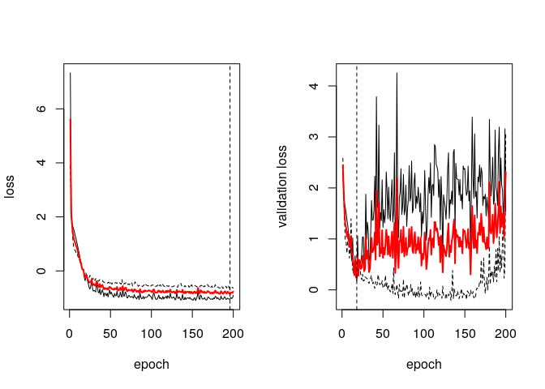

``` r
mod %>% fit(epochs = stop_iter_cv_result(cvres), view_metrics=FALSE)
pred <- mod %>% predict(test)

mean((pred-test$LWAGE)^2)
```

    ## [1] 0.04597267

### Deep Quantile Regression on Motorcycle Data

``` r
#### Apply deep distributional regression to 
#### Silverman's Motorcycle data, 
#### and use distributional regression to compare
#### with quantile regression
library(MASS)
```

    ## 
    ## Attaching package: 'MASS'

    ## The following object is masked from 'package:deepregression':
    ## 
    ##     select

``` r
data("mcycle")
set.seed(4-2)
train_ind <- sample(1:nrow(mcycle), 90)
train <- mcycle[train_ind,]
test <- mcycle[setdiff(1:nrow(mcycle),train_ind),]

deep_mod <- function(x) x %>% 
  layer_dense(units = 50, activation = "tanh", use_bias = TRUE) %>%
  layer_dense(units = 10, activation = "linear") %>%
  layer_dense(units = 1, activation = "linear")

mod_deep <- deepregression(y = train$accel, 
                           list_of_formulae = list(loc = ~ 0 + d(times),
                                                   scale = ~ 1 + times),
                           list_of_deep_models = list(deep_mod, NULL),
                           data = train,
                           train_together = FALSE,
                           family = "normal",
                           cv_folds = 4)

# cvres <- mod_deep %>% cv(epochs = 2500)

mod_deep %>% fit(epochs = 5000, view_metrics=FALSE)

pred <- mod_deep %>% predict(test)

sqrt(mean((pred-test$accel)^2))
```

    ## [1] 25.54391

``` r
#### plot mean and quantiles

mean <- mod_deep %>% mean(data = mcycle)
q40 <- mod_deep %>% quantile(data = mcycle, value = 0.4)
q60 <- mod_deep %>% quantile(data = mcycle, value = 0.6)
q10 <- mod_deep %>% quantile(data = mcycle, value = 0.1)
q90 <- mod_deep %>% quantile(data = mcycle, value = 0.9)

fitdf <- cbind(mcycle, data.frame(mean = mean,
                                  q40 = q40,
                                  q60 = q60,
                                  q10 = q10,
                                  q90 = q90)
)

library(reshape2)
library(ggplot2)

fitdf %>% 
  ggplot() + 
  geom_point(aes(x=times, y=accel)) + 
  geom_line(aes(x=times, y=mean), col="red", linetype = 1) + 
  geom_line(aes(x=times, y=q40), col="red", linetype = 2) + 
  geom_line(aes(x=times, y=q60), col="red", linetype = 2) + 
  geom_line(aes(x=times, y=q10), col="red", linetype = 3) + 
  geom_line(aes(x=times, y=q90), col="red", linetype = 4)
```

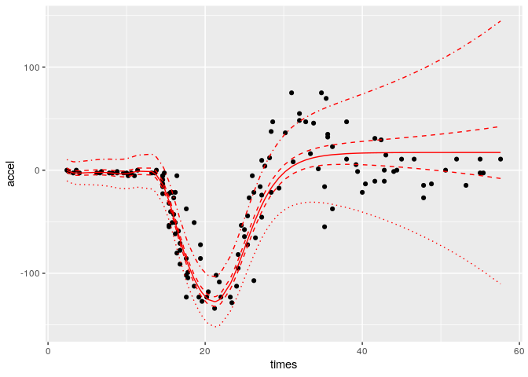

### High-Dimensional Ridge and Lasso Regression

This examples shows how we can seamlessly employ the software to fit high-dimensional Ridge and Lasso Regression with 2000 covariates with just

``` r
data <- read.table("data/colon-cancer")
colnames(data) <- c("outcome", paste0("X", 1:2000))
data[,-1] <- lapply(data[,-1], function(x) as.numeric(gsub("\\d+:","",x)))
data$outcome <- as.numeric(data$outcome > 0)

c(train_ind, test_ind) %<-% list(1:42, 42+1:20)

train <- data[train_ind,]
test <- data[test_ind,]

# use Ridge penalty
form <- as.formula(paste0("~ s(", 
                          paste(colnames(train)[-1],
                                collapse=",bs='re') + s("),
                          ",bs='re')"))

mod <- deepregression(y = train$outcome[train_ind],
                      data = train[,-1],
                      list_of_formulae = 
                        list(logit = form),
                      family = "bernoulli",
                      list_of_deep_models = NULL,
                      cv_folds = 14,
                      df=0.1)

cvres <- mod %>% cv(epochs = 100)
```

    ## Fitting Fold  1  ... 
    ## Done in 8.350903  secs 
    ## Fitting Fold  2  ... 
    ## Done in 7.316403  secs 
    ## Fitting Fold  3  ... 
    ## Done in 7.547827  secs 
    ## Fitting Fold  4  ... 
    ## Done in 7.393666  secs 
    ## Fitting Fold  5  ... 
    ## Done in 7.421143  secs 
    ## Fitting Fold  6  ... 
    ## Done in 7.562559  secs 
    ## Fitting Fold  7  ... 
    ## Done in 7.367535  secs 
    ## Fitting Fold  8  ... 
    ## Done in 7.449694  secs 
    ## Fitting Fold  9  ... 
    ## Done in 7.508204  secs 
    ## Fitting Fold  10  ... 
    ## Done in 7.372808  secs 
    ## Fitting Fold  11  ... 
    ## Done in 7.523059  secs 
    ## Fitting Fold  12  ... 
    ## Done in 7.389189  secs 
    ## Fitting Fold  13  ... 
    ## Done in 7.653446  secs 
    ## Fitting Fold  14  ... 
    ## Done in 7.36549  secs

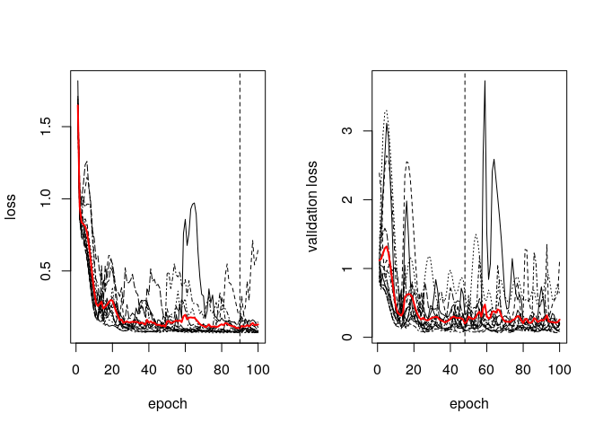

``` r
mod %>% fit(epochs = stop_iter_cv_result(cvres),
            validation_split = NULL, view_metrics = FALSE)
coef <- mod %>% coef()
summary(coef[[1]][[1]])
```

    ##        V1            
    ##  Min.   :-0.7474528  
    ##  1st Qu.:-0.0069700  
    ##  Median :-0.0003673  
    ##  Mean   :-0.0005047  
    ##  3rd Qu.: 0.0061044  
    ##  Max.   : 0.0331945

``` r
pred <- mod %>% predict(newdata = test[,-1])
boxplot(pred ~ test$outcome)

### fit with Lasso
form <- as.formula(paste0("~ ", 
                          paste(colnames(train)[-1],
                                collapse=" + ")))

mod <- deepregression(y = train$outcome[train_ind],
                      data = train[,-1],
                      list_of_formulae = 
                        list(logit = form),
                      family = "bernoulli",
                      lambda_lasso = 0.1,
                      list_of_deep_models = NULL,
                      cv_folds = 14)

cvres <- mod %>% cv(epochs = 100)
```

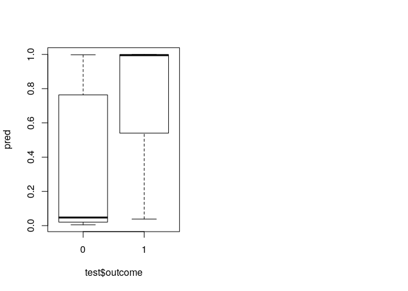

    ## Fitting Fold  1  ... 
    ## Done in 4.992848  secs 
    ## Fitting Fold  2  ... 
    ## Done in 4.706645  secs 
    ## Fitting Fold  3  ... 
    ## Done in 4.479601  secs 
    ## Fitting Fold  4  ... 
    ## Done in 4.609457  secs 
    ## Fitting Fold  5  ... 
    ## Done in 4.443733  secs 
    ## Fitting Fold  6  ... 
    ## Done in 4.641526  secs 
    ## Fitting Fold  7  ... 
    ## Done in 4.577093  secs 
    ## Fitting Fold  8  ... 
    ## Done in 4.515954  secs 
    ## Fitting Fold  9  ... 
    ## Done in 4.741314  secs 
    ## Fitting Fold  10  ... 
    ## Done in 4.408573  secs 
    ## Fitting Fold  11  ... 
    ## Done in 4.573948  secs 
    ## Fitting Fold  12  ... 
    ## Done in 4.631801  secs 
    ## Fitting Fold  13  ... 
    ## Done in 4.526399  secs 
    ## Fitting Fold  14  ... 
    ## Done in 4.577093  secs

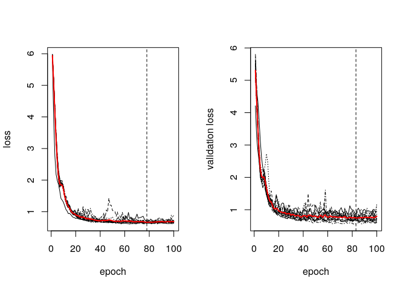

``` r
mod %>% fit(epochs = stop_iter_cv_result(cvres),
            validation_split = NULL, view_metrics = FALSE)
coef <- mod %>% coef()

pred <- mod %>% predict(newdata = test[,-1])
boxplot(pred ~ test$outcome)
plot(coef[[1]][[1]])
```

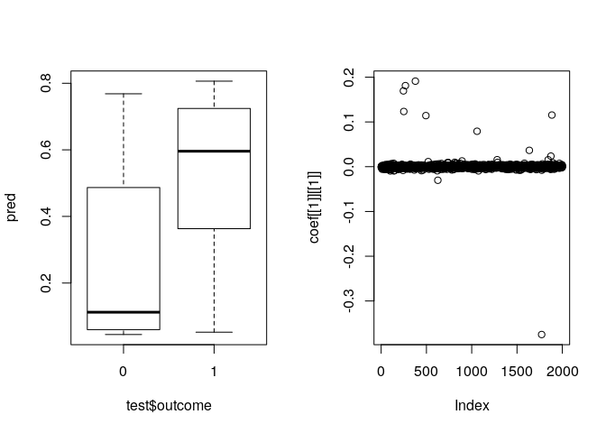
