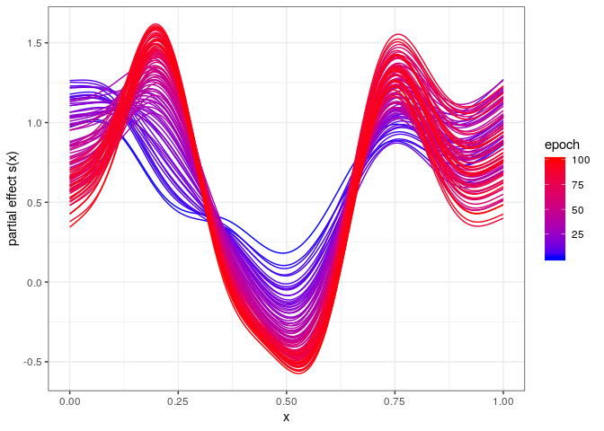
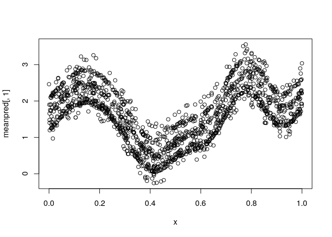
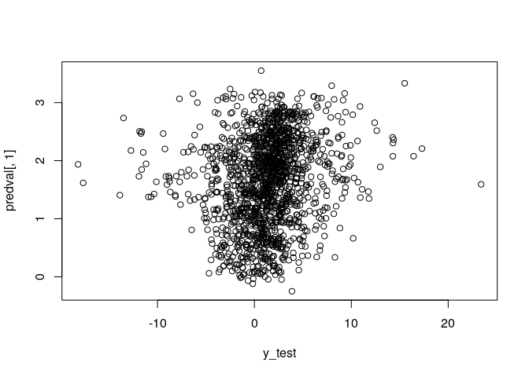
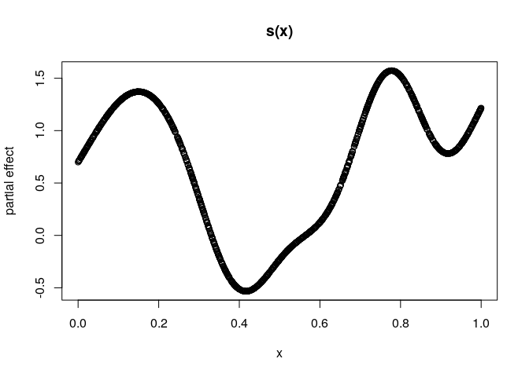

deepregression
==============

Fitting Deep Distributional Regression in R

Installation
============

Since the repository is still private, clone the repository to your local machine and run the following

``` r
library(devtools)
load_all("R")
```

    ## Loading deepregression

Also make sure you have installed all the dependencies:

-   Matrix
-   dplyr
-   keras
-   mgcv
-   reticulate
-   tensorflow
-   tfprobability

In the future, the package can be installed as follows:

To install the latest version of deepregression:

``` r
library(devtools)
install_github("davidruegamer/deepregression")
```

Examples
========

1.  [Deep Linear Regression](#deep-linear-regression)
2.  [Deep Logistic Regression](#deep-logistic-regression)
3.  [Deep GAM](#deep-gam)
4.  [GAMLSS](#gamlss)
5.  [Deep GAMLSS](#deep-gamlss)
6.  [Examples for each Distribution](#examples-for-each-distribution)

Deep Linear Regression
----------------------

We first create a very simple linear regression first where we try to model the non-linear part of the data generating process using a complex neural network and an intercept using a structured linear part.

``` r
set.seed(24)

# generate the data
n <- 1500
b0 <- 1

# training data; predictor 
x <- runif(n) %>% as.matrix()
true_mean_fun <- function(xx) sin(10*xx) + b0

# training data
y <- true_mean_fun(x) + rnorm(n = n, mean = 0, sd = 2)

data = data.frame(x = x)

# test data
x_test <- runif(n) %>% as.matrix()

validation_data = data.frame(x = x_test)

y_test <- true_mean_fun(x_test) + rnorm(n = n, sd = 2)
#####################################################################

#####################################################################
# Define a Deep Model
# We use three hidden layers for the location:
deep_model <- function(x) x %>% 
  layer_dense(units = 256, activation = "relu", use_bias = FALSE) %>%
  layer_dense(units = 128, activation = "relu") %>%
  layer_dropout(rate = 0.2) %>%
  layer_dense(units = 64, activation = "relu") %>% 
  layer_dropout(rate = 0.2) %>%
  layer_dense(units = 16, activation = "relu") %>% 
  layer_dense(units = 1, activation = "linear")
#####################################################################

#####################################################################
# Initialize the model using the function
# provided in deepregression
mod <- deepregression(
  # supply data (response and data.frame for covariates)
  y = y,
  data = data,
  # define how parameters should be modeled
  list_of_formulae = list(loc = ~ 1 + d(x), scale = ~1),
  list_of_deep_models = list(deep_model, NULL)
)
# fit model (may take a few minutes)
mod %>% fit(epochs=1000, verbose = FALSE, view_metrics = FALSE)
# predict
mean <- mod %>% fitted()
true_mean <- true_mean_fun(x)

# compare means
plot(true_mean ~ x, ylab="partial effect")
points(c(as.matrix(mean)) ~ x, col = "red")
legend("bottomright", col=1:2, pch = 1, legend=c("true mean", "deep prediction"))
```


Deep Logistic Regression
------------------------

We create a very simple logistic regression first where we try to model the non-linear part of the data generating process using a complex neural network and an intercept using a structured linear part.

``` r
set.seed(24)

# generate the data
n <- 1500
b0 <- 1

# training data; predictor 
x <- runif(n) %>% as.matrix()
true_mean_fun <- function(xx) plogis(sin(10*xx) + b0)

# training data
y <- rbinom(n = n, size = 1, prob = true_mean_fun(x))

data = data.frame(x = x)

# test data
x_test <- runif(n) %>% as.matrix()

validation_data = data.frame(x = x_test)

y_test <- rbinom(n = n, size = 1, prob = true_mean_fun(x_test))
#####################################################################

#####################################################################
# Define a Deep Model
# We use three hidden layers for the location:
deep_model <- function(x) x %>% 
  layer_dense(units = 128, activation = "relu", use_bias = FALSE) %>%
  layer_dense(units = 64, activation = "relu") %>%
  layer_dropout(rate = 0.2) %>%
  layer_dense(units = 32, activation = "relu") %>% 
  layer_dropout(rate = 0.2) %>%
  layer_dense(units = 8, activation = "relu") %>% 
  layer_dense(units = 1, activation = "linear")
#####################################################################

#####################################################################
# Initialize the model using the function
# provided in deepregression
mod <- deepregression(
  # supply data (response and data.frame for covariates)
  y = y,
  data = data,
  # define how parameters should be modeled
  list_of_formulae = list(logits = ~ 1 + d(x)),
  list_of_deep_models = list(deep_model),
  # family binomial
  family = "bernoulli"
)
# fit model
mod %>% fit(epochs=100, verbose = FALSE, view_metrics = FALSE)
# predict
mean <- mod %>% predict(newdata = validation_data)
true_mean <- true_mean_fun(x_test)

# compare means
plot(true_mean ~ x_test, ylab="partial effect")
points(c(as.matrix(mean)) ~ x_test, col = "red")
legend("bottomright", col=1:2, pch = 1, legend=c("true mean", "deep prediction"))
```


Deep GAM
--------

We now create a very simple logistic additive regression first where we try to model the non-linear part of the data generating process using both a complex neural network and a spline.

``` r
set.seed(24)

# generate the data
n <- 1500
b0 <- 1

# training data; predictor 
x <- runif(n) %>% as.matrix()
true_mean_fun <- function(xx) plogis(sin(10*xx) + b0)

# training data
y <- rbinom(n = n, size = 1, prob = true_mean_fun(x))

data = data.frame(x = x)

# test data
x_test <- runif(n) %>% as.matrix()

validation_data = data.frame(x = x_test)

y_test <- rbinom(n = n, size = 1, prob = true_mean_fun(x_test))
#####################################################################

#####################################################################
# Define a Deep Model
# We use three hidden layers for the location:
deep_model <- function(x) x %>% 
  layer_dense(units = 128, activation = "relu", use_bias = FALSE) %>%
  layer_dense(units = 64, activation = "relu") %>%
  layer_dropout(rate = 0.2) %>%
  layer_dense(units = 32, activation = "relu") %>% 
  layer_dropout(rate = 0.2) %>%
  layer_dense(units = 8, activation = "relu") %>% 
  layer_dense(units = 1, activation = "linear")
#####################################################################

#####################################################################
# Initialize the model using the function
# provided in deepregression
mod <- deepregression(
  # supply data (response and data.frame for covariates)
  y = y,
  data = data,
  # define how parameters should be modeled
  list_of_formulae = list(logits = ~ 1 + s(x, bs = "tp") + d(x)),
  list_of_deep_models = list(deep_model),
  # family binomial n=1
  family = "bernoulli",
  df = 10 # use no penalization for spline
)
# fit model
history <- mod %>% fit(epochs=100, verbose = FALSE, view_metrics = FALSE,
                       save_weights = TRUE)
# plot model
par(mfrow=c(1,2))
plot(true_mean_fun(x) ~ x)
mod %>% plot()
```


``` r
# plot history of spline
BX <- mod$init_params$parsed_formulae_contents[[1]][[2]]$x$X
coef_history <- history$weighthistory[-1,]
f_history <- sapply(1:ncol(coef_history), function(j) BX%*%coef_history[,j])
library(ggplot2)
library(reshape2)
df <- melt(cbind(x=x, as.data.frame(f_history)), id.vars="x")
df$variable = as.numeric(df$variable)
ggplot(df, aes(x=x,y=value, colour=as.integer(variable), group=factor(variable))) + 
  geom_line() + 
  scale_colour_gradient(name = "epoch", 
                        low = "blue", high = "red") + 
  ylab("partial effect s(x)") + theme_bw()
```



We can check which of the function the cross-validation would have chosen by doing the following:

``` r
mod <- deepregression(
  # supply data (response and data.frame for covariates)
  y = y,
  data = data,
  # define how parameters should be modeled
  list_of_formulae = list(logits = ~ 1 + s(x, bs = "tp") + d(x)),
  list_of_deep_models = list(deep_model),
  # family binomial n=1
  family = "bernoulli",
  df = 10 # use no penalization for spline
)

cvres <- mod %>% cv(epochs=100)
```

    ## Warning in cv(., epochs = 100): No folds for CV given, using k = 10.

    ## Fitting Fold  1  ... 
    ## Done.
    ## Fitting Fold  2  ... 
    ## Done.
    ## Fitting Fold  3  ... 
    ## Done.
    ## Fitting Fold  4  ... 
    ## Done.
    ## Fitting Fold  5  ... 
    ## Done.
    ## Fitting Fold  6  ... 
    ## Done.
    ## Fitting Fold  7  ... 
    ## Done.
    ## Fitting Fold  8  ... 
    ## Done.
    ## Fitting Fold  9  ... 
    ## Done.
    ## Fitting Fold  10  ... 
    ## Done.


Get the optimal stopping iteration and train the whole model again:

``` r
bestiter <- stop_iter_cv_result(cvres)
mod <- deepregression(
  # supply data (response and data.frame for covariates)
  y = y,
  data = data,
  # define how parameters should be modeled
  list_of_formulae = list(logits = ~ 1 + s(x, bs = "tp") + d(x)),
  list_of_deep_models = list(deep_model),
  # family binomial n=1
  family = "bernoulli",
  validation_split = NULL,
  df = 10 # use no penalization for spline
)
# fit model
history <- mod %>% fit(epochs=bestiter, verbose = FALSE, view_metrics = FALSE,
                       save_weights = TRUE)
# plot model
par(mfrow=c(1,2))
plot(true_mean_fun(x) ~ x)
mod %>% plot()
```


GAMLSS
------

We not create a standard GAMLSS model with Gaussian distribution by modeling the expectation using additive terms and the standard deviation by a linear term.

``` r
set.seed(24)

# generate the data
n <- 1500
b0 <- 1

# training data; predictor 
x <- runif(n) %>% as.matrix()
z <- runif(n) %>% as.matrix()
true_mean_fun <- function(xx,zz) sin(10*xx) + zz^2 + b0
true_sd_fun <- function(xl) exp(2 * xl)
true_dgp_fun <- function(xx,zz)
{
  
  eps <- rnorm(n) * true_sd_fun(xx)
  y <- true_mean_fun(xx, zz) + eps
  return(y)
  
}

# compose training data with heteroscedastic errors
y <- true_dgp_fun(x,z)
data = data.frame(x = x, z = z)

# test data
x_test <- runif(n) %>% as.matrix()
z_test <- runif(n) %>% as.matrix()

validation_data = data.frame(x = x_test, z = z_test)

y_test <- true_dgp_fun(x_test, z_test)
#####################################################################

#####################################################################
# Define a Deep Model
# We use three hidden layers for the location:
deep_model <- function(x) x %>% 
  layer_dense(units = 128, activation = "relu", use_bias = FALSE) %>%
  layer_dense(units = 64, activation = "relu") %>%
  layer_dropout(rate = 0.2) %>%
  layer_dense(units = 32, activation = "relu") %>% 
  layer_dropout(rate = 0.2) %>%
  layer_dense(units = 8, activation = "relu") %>% 
  layer_dense(units = 1, activation = "linear")
#####################################################################

#####################################################################
# Initialize the model using the function
# provided in deepregression
mod <- deepregression(
  # supply data (response and data.frame for covariates)
  y = y,
  data = data,
  # define how parameters should be modeled
  list_of_formulae = list(loc = ~ 1 + s(x, bs="tp") + s(z, bs="tp"),
                          scale = ~ 0 + x),
  list_of_deep_models = list(NULL, deep_model),
  # family binomial n=1
  family = "normal"
)
# fit model
mod %>% fit(epochs=1000, verbose = FALSE, view_metrics = FALSE)
# summary(mod)
# coefficients
mod %>% coef()
```

    ## $loc
    ## $loc$structured_nonlinear
    ##             [,1]
    ##  [1,]  0.1138101
    ##  [2,]  0.3630292
    ##  [3,] -0.3258072
    ##  [4,] -2.4985819
    ##  [5,] -0.8742989
    ##  [6,] -0.1247991
    ##  [7,]  0.4934088
    ##  [8,]  1.2771574
    ##  [9,] -0.7480861
    ## [10,]  0.6138318
    ## [11,]  2.3805492
    ## [12,]  0.9562155
    ## [13,] -0.4752308
    ## [14,]  0.1606225
    ## [15,] -0.1660998
    ## [16,] -0.2885971
    ## [17,]  0.1197857
    ## [18,] -0.3260005
    ## [19,] -0.5656883
    ## [20,]  0.7403078
    ## [21,]  1.6250267
    ## 
    ## 
    ## $scale
    ## $scale$structured_linear
    ##          [,1]
    ## [1,] 2.017193

``` r
# plot model
par(mfrow=c(2,2))
plot(sin(10*x) ~ x)
plot(z^2 ~ z)
mod %>% plot()
```


``` r
# get fitted values
meanpred <- mod %>% fitted()
par(mfrow=c(1,1))
plot(meanpred[,1] ~ x)
```



``` r
# predict
predval <- mod %>% predict(newdata = validation_data)
plot(predval[,1] ~ y_test)
```



Deep GAMLSS
-----------

We now extend the example 4 by a Deep model part.

``` r
set.seed(24)

# generate the data
n <- 1500
b0 <- 1

# training data; predictor 
x <- runif(n) %>% as.matrix()
z <- runif(n) %>% as.matrix()
true_mean_fun <- function(xx,zz) sin(10*xx) + zz^2 + b0
true_sd_fun <- function(xl) exp(2 * xl)
true_dgp_fun <- function(xx,zz)
{
  
  eps <- rnorm(n) * true_sd_fun(xx)
  y <- true_mean_fun(xx, zz) + eps
  return(y)
  
}

# compose training data with heteroscedastic errors
y <- true_dgp_fun(x,z)
data = data.frame(x = x, z = z)

# test data
x_test <- runif(n) %>% as.matrix()
z_test <- runif(n) %>% as.matrix()

validation_data = data.frame(x = x_test, z = z_test)

y_test <- true_dgp_fun(x_test, z_test)
#####################################################################

#####################################################################
# Define a Deep Model
# We use three hidden layers for the location:
deep_model <- function(x) x %>% 
  layer_dense(units = 128, activation = "relu", use_bias = FALSE) %>%
  layer_dense(units = 64, activation = "relu") %>%
  layer_dropout(rate = 0.2) %>%
  layer_dense(units = 32, activation = "relu") %>% 
  layer_dropout(rate = 0.2) %>%
  layer_dense(units = 8, activation = "relu") %>% 
  layer_dense(units = 1, activation = "linear")
#####################################################################

#####################################################################
# Initialize the model using the function
# provided in deepregression
mod <- deepregression(
  # supply data (response and data.frame for covariates)
  y = y,
  data = data,
  # define how parameters should be modeled
  list_of_formulae = list(loc = ~ 1 + s(x, bs="tp") + d(z),
                          scale = ~ 1 + x),
  list_of_deep_models = list(deep_model, NULL),
  # family normal
  family = "normal"
)
# fit model
mod %>% fit(epochs=500, verbose = FALSE, view_metrics = FALSE)
# plot model
mod %>% plot()
```



``` r
# get coefficients
mod %>% coef()
```

    ## $loc
    ## $loc$structured_nonlinear
    ##              [,1]
    ##  [1,]  0.53341657
    ##  [2,]  0.06368355
    ##  [3,] -0.22148590
    ##  [4,] -2.34322286
    ##  [5,] -0.90492940
    ##  [6,] -0.22494067
    ##  [7,]  0.44192263
    ##  [8,]  1.18803310
    ##  [9,] -0.53019941
    ## [10,]  0.60471821
    ## [11,]  2.05293274
    ## 
    ## 
    ## $scale
    ## $scale$structured_linear
    ##           [,1]
    ## [1,] 0.6880151
    ## [2,] 2.0306637

Examples for each Distribution
------------------------------

In this example we just demonstrate all the distributions that can currently be fitted using the deepregression framework. Updates will happen quite frequently.

``` r
set.seed(24)

# generate the data
n <- 1500
b0 <- 1

# training data; predictor 
x <- runif(n) %>% as.matrix()
z <- runif(n) %>% as.matrix()
y <- runif(n) %>% as.matrix()
data = data.frame(x = x, z = z)

dists = 
c(
"normal", "bernoulli", "bernoulli_prob", 
"beta", "betar", "cauchy", "chi2", "chi","exponential",
"gamma", "gammar", "gumbel", "half_cauchy", "half_normal", "horseshoe",
"inverse_gamma", "inverse_gaussian", "laplace", "log_normal",
"logistic", "negbinom", "negbinom", "pareto", 
"poisson", "poisson_lograte", "student_t",
"student_t_ls", "uniform"
)
#####################################################################

#####################################################################
# check out if distributions work
#####################################################################
silent = TRUE
for(dist in dists)
{
  cat("Fitting", dist, "model... ")
  suppressWarnings(
    mod <- try(deepregression(
      y = y,
      data = data,
      # define how parameters should be modeled
      list_of_formulae = list(~ 1 + x, ~ 1 + z, ~ 1),
      list_of_deep_models = NULL,
      family = dist
    ), silent=silent)
  )
  # test if model can be fitted
  if(class(mod)=="try-error")
  {
    cat("Failed to initialize the model.\n")
    next
  }
  fitting <- try(
    res <- mod %>% fit(epochs=2, verbose = FALSE, view_metrics = FALSE),
    silent=silent
  )
  if(class(fitting)=="try-error"){ 
    cat("Failed to fit the model.\n")
  }else if(sum(is.nan(unlist(res$metrics))) > 0){
    cat("NaNs in loss or validation loss.\n")
  }else if(any(unlist(res$metrics)==Inf)){
    cat("Infinite values in loss or validation loss.\n")
  }else{
    # print(res$metrics)
    cat("Success.\n")
  }
}
```

    ## Fitting normal model... Success.
    ## Fitting bernoulli model... Success.
    ## Fitting bernoulli_prob model... Success.
    ## Fitting beta model... Success.
    ## Fitting betar model... Success.
    ## Fitting cauchy model... Success.
    ## Fitting chi2 model... Success.
    ## Fitting chi model... Success.
    ## Fitting exponential model... Success.
    ## Fitting gamma model... Success.
    ## Fitting gammar model... Success.
    ## Fitting gumbel model... Success.
    ## Fitting half_cauchy model... Infinite values in loss or validation loss.
    ## Fitting half_normal model... Success.
    ## Fitting horseshoe model... Success.
    ## Fitting inverse_gamma model... Success.
    ## Fitting inverse_gaussian model... Success.
    ## Fitting laplace model... Success.
    ## Fitting log_normal model... Success.
    ## Fitting logistic model... Success.
    ## Fitting negbinom model... Success.
    ## Fitting negbinom model... Success.
    ## Fitting pareto model... Infinite values in loss or validation loss.
    ## Fitting poisson model... Success.
    ## Fitting poisson_lograte model... Success.
    ## Fitting student_t model... Success.
    ## Fitting student_t_ls model... Success.
    ## Fitting uniform model... Infinite values in loss or validation loss.
